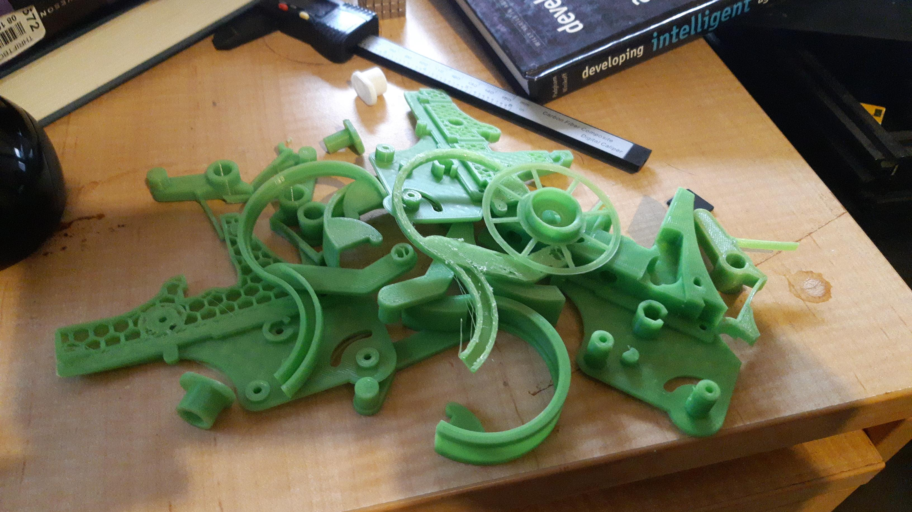
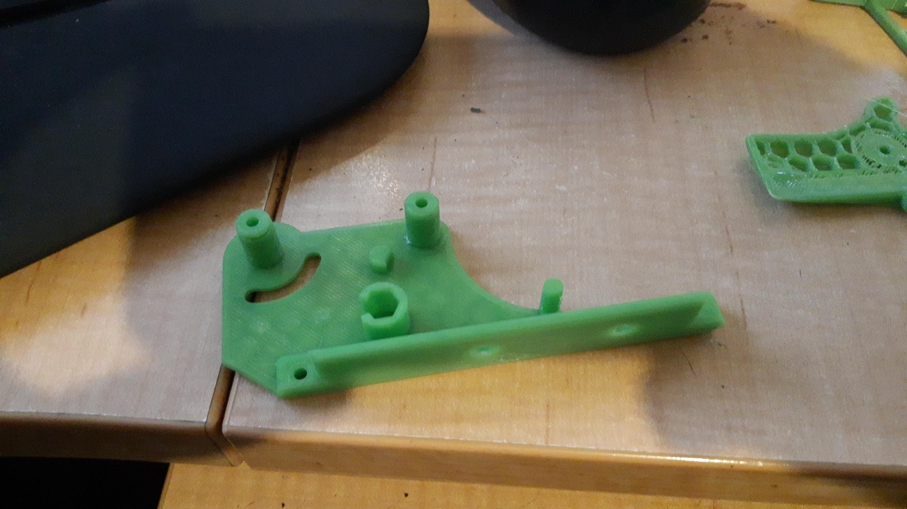

Try, try, try, try, ... , again and again and again.

Compromise

So, I am not liking the green filament. Not fan of the colour, but opted into it as a homage to designer.

Not a fan of the green filament, it is, for some reason, a pig to print with.

Finnicky about sticking to bed. Changed temp. Speed of first layer. Laid down sticky stuff.

Mating all the parts up is such a chore. Worked out the tweaking for "axle" seems arse about. It actually is on the "holes" not the "axles" per se. So, a negative value was making the "holes" smaller not bigger as was required.

Test print a dud. Used the test print to find, apparently, my printer needed axle parameter set to 0.16. Pieces did not fit at 0.16 nor 0.18 so I am trying a 0.40 axle setting at the moment, on the friction wheel as the test piece, since a 0.25 axle setting was probably just on the borderline of actually looking half way like it might be force pressed on. NOPE. Had to try 0.50, now it seems snug but not tight.

Opted for the flat screw down instead of the extrusion fitted. The parameters include spacing of the holes. The compromise is then go without the fang dangles. The photo is before I found the parameters for the holes. They are 30mm apart but need be 40mm apart to fit to the two 2020 extrusions that the original feeders fit into. A nice compromise. Just now ordered a 100 pack of M4 x 8mm counter sunk from Aliexpress, but will get a smaller pack of same locally (for oodles more $$$) to have some for the trial fittings.
