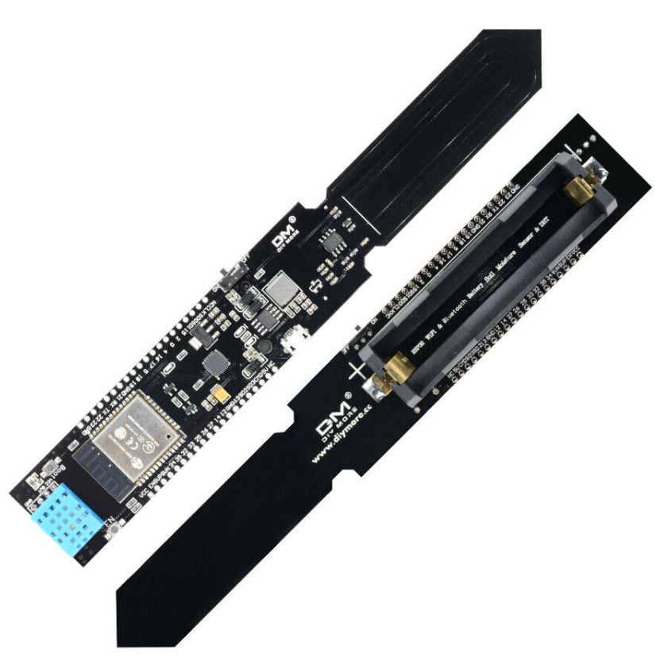
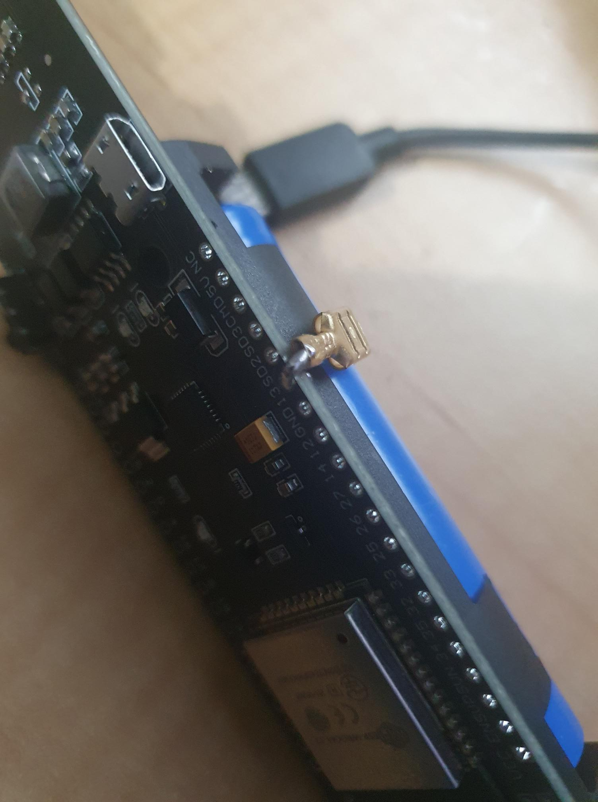

... by the capacitive inputs of the ESP32, as this is my first time.


I have a DM moisture sensor, with ESP32, battery etc., a la:


[](./dm-moisture.png)


I borrowed code from [here to get the moisture and humidity readings](https://www.instructables.com/ESP32-WiFi-SOIL-MOISTURE-SENSOR/).


As I am building the moisture sensor into my home system (including sprinklers and other widgets related to the garden). My home system has both MQTT and Homeassistant, so I have a MQTT client running on the moisture wand.


In its raw form, the moisture wand was sending a moisture/humidity reading every `loop()`, which is not optimum. So, I thought I would add a push button switch, then remembered the gossip about the capacitive touch pins on the ESP32.


Cool.


So, I assigned pin 13 to this task, thank you for the pinouts [GeekWorm](https://wiki.geekworm.com/WEMOS_ESP32_Board_with_18650_Battery_Holder)! (Yes, this pinout reads across to the moisture wand.) I used pin 13, since it is a TOUCH input that was about in the right position, when holding the wand while taking measurements. I made the "button" by crimping a connector to a thick pin cut off an SCR, voilà!


[](./button.jpg)


Firstly, I needed to work out that this is not a binary thing (again, not bothering to read *destructions*). The function `touchRead(pin#)` returns a range of values. So, I worked out I could hold off sending messages to the MQTT topics with:


```
if (toundRead(BUTTON_PIN) < SOME_LOWER_THRESHOLD) { ... etc.

```


Then that would only see bursts (obviously) whilst the pin was being touched.


I needed a means to dumb this down.


I found an [interrupt based version of a capacitive pin "debounce".](https://www.instructables.com/ESP32-Capacitive-Touch-Buttons/) Fancy interrupts and timers and, as usual, it didn't seem to want to work. I was getting an exception around access to analogue pins. That was with code that was simply block copied into my project. No discussion about gotchas in the source article, ...


[](./whaaaaatttt.png)

**GOTCHA!**


I REAAALLLY needed a means to dumb this down.


In my head, it was a simple state machine problem. As there are means to attach interrupts to the touch pins, so I ended up with the following (much left to the imagination, just focus on the touch pin state machine).


```
enum buttonStates {buttonDown, buttonHold, buttonUp};
buttonStates buttonState = buttonUp;

void buttonDownDetectInterrupt (void) {
  buttonState = buttonDown;
}

// setup wifi and callbacks etc.
void setup() {
  setup_wifi();

  // this is for messages pushed to devices
  client.set_callback(callback);  

  Serial.begin(115200);

  touchAttachInterrupt(TOUCHPIN, 
                       buttonDownDetectInterrupt, 
                       BUTTON_DOWN_THRESH);
}


// forever
void loop() {

  
  if (!client.connected()) {

    allStop();  // Do something to "safe" the device
    reconnect();
  }

  //exponential smoothing of soil moisture
  asoilmoist=0.95*asoilmoist+0.05*analogRead(moistpin);


  // button state machine
  if (buttonState == buttonDown) {

      // stop reacting to button still down
      touchDetachInterrupt(TOUCHPIN);

      // hold button down
      buttonState = buttonHold;

      // give me one ping captain

          //global variable to store the gravimetric soil water content
          gwc=exp(-0.0015*asoilmoist + 0.7072); 

          temp = dht.readTemperature();
          hum = dht.readHumidity();

          // packs a JSON message to send via MQTT broker
          moistureMessage ( asoilmoist, gwc, temp, hum );  

  } else if (buttonState == buttonHold) {

      // keep pin down till it makes sense its up
      if (touchRead(TOUCHPIN) > BUTTON_UP_THRESH) {

        buttonState = buttonUp;
        touchAttachInterrupt(TOUCHPIN, 
                             buttonDownDetectInterrupt, 
                             BUTTON_DOWN_THRESH);
      }
  }

  client.loop();

}
```


This works a treat!


And works as you would expect.


You touch and hold the pin, and you get one and only one message. You release the pin, and then the state machine sets you up to go around again. It works just like a physical push button, with a pull down resistor and debounce code ([now where did I see one of those? ...](https://organicmonkeymotion.wordpress.com/2022/12/11/8380/) )


[](./happy-as-a-monkey-with-a-fist-full-of-bananas-small.png)

**WITH A FIST FULL OF BANANAS!**


Things still to do:


1. Add SSD1306 128x32 pixel display ([now where did I see one of those? ...](https://organicmonkeymotion.wordpress.com/2022/12/11/8380/) )
2. Add an RFID reader.


The RFID reader is because I want to tag pots with vegetables and herbs around the place, to track watering of the pots. The idea is that I will expand the message to include the RFID, to match the reading with a gardening pot or garden bed location.


[](./doh.png)

HUH?


Go figure, in among the reported readings, you get the occasional "nan" for temp and humidity:


```
14/12/2022, 07:54:57node: 62153bec36741810
/os/gadget/sensor/moisture/10726100 : msg.payload : string[62]
"{ "moisture": 3420.96,"gwc": 0.01,"temp": nan,"humidity": nan}"
```


As this is temp and humidity, it should not be varying wildly between readings on the day, so I simply lie with:


```
// lie if need be, they'll probably both be nan
temp = dht.readTemperature();
if (isnan(temp)) {
   temp=oldTemp;
} else {
   oldTemp=temp;
}

hum = dht.readHumidity();
if (isnan(hum)) {
   hum=oldHum;
} else {
   oldHum=hum;
}
```


You could opt for the receiving app to sort it out. Note `isnan()` comes with the `DHT` library – telling, right!?


I may tinker with a `STUCK_SENSOR` debug topic. Probably just against a count of `n` successive `nan` results. Whether it is worth, in this instance, splitting the error out into two errors is unknown. I suspect, from discussions on this topic, both humidity and temp will come back `nan` at the same time. So, the debug may report `DHT` down, rather than individual sensors within the `DHT`.


The final result is at [github](https://github.com/OrganicMonkeyMotion/moisture-wand).


https://www.youtube.com/watch?v=EmeJrpuaZm0

**The result!**


[](./bazmundi_monkey_with_spectacles_in_electronics_workshop_with_os_fbdff510-5864-49fd-a16a-ea05abca085f.png)
