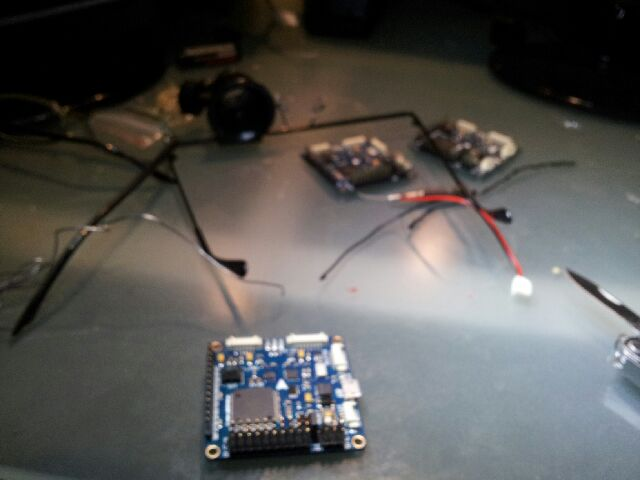
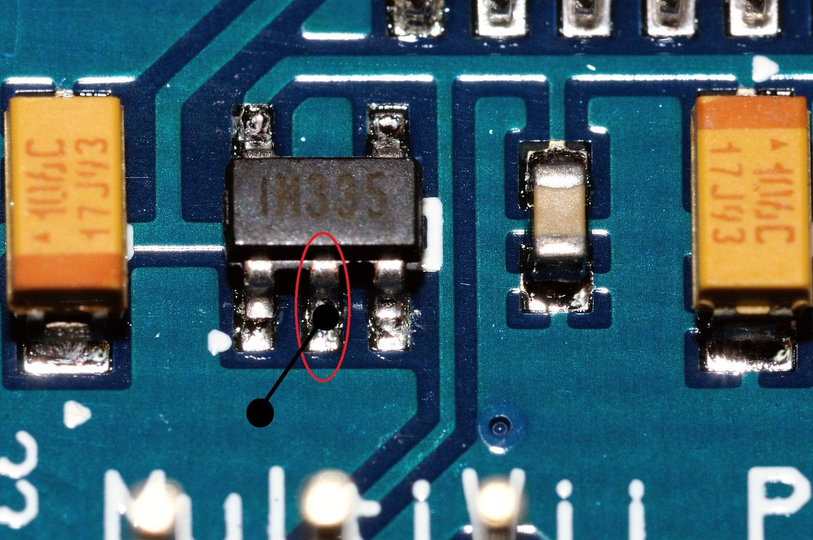

... or the evening.

The photo is a bit fuzzy, sorry but apt.
At my age I am still in denial about my eyes and there was no way I was [making the mod to these boards](http://organicmonkeymotion.wordpress.com/2012/12/14/it-never-rains/ "It never rains …") ...

... without 1) my new 2x magnifying lens LED lamp and 2) my 20x jeweler's monocle.
***POST SCRIPT***
I poked around on internet and found a video that warned that the USB cable for the boards needed to have the cable inserted BEFORE the other end was pushed into the HOST computer (phew!).  I found a second website where the guy, who got the same board, was bleating about being stung and woe is me etc.  At least he had some useful info on how and which LEDs should light up if the board was working properly so:

1. I plugged USB cable into each board in turn.
2. Plugged the cable into the HOST.
3. Watched all the required LED blinking of a properly working board.

QED
I made sure I inspected the soldering/grounding of the SMD pin so I was happy there were no shorts (the 20x view of the jeweler monocle - like WOW!) so I was happy things would sort themselves out.
I am happy I have the boards.
The [safety bleat](http://mymobilemms.com/proxy/index.php?q=uggc%3A%2F%2Fjjj.eptebhcf.pbz%2Fsbehzf%2Ffubjguernq.cuc%3Fg%3D1790506 "Oh Nooooooo!") is a little thin given some of the things I talk about at my [other blog](http://miniuavsafety.wordpress.com/ "There is a bit more to risk and safety than hobby UAV hacks think there is").  Notably, most of the hardware/software design for these hobby hacks have no safety assurance in any event and my solder join is likely to be more reliable than the Pb-free joints on the rest of the board as they will suffer tin-whiskers and likely fail with a short at some stage.
Oh well, can't sneeze at $30 odd for a 10DOF board now can one.
