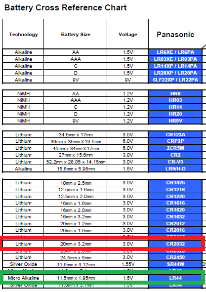

I bought two stainless steel digital calipers from Aliexpress. I especially got a 200mm one for special cases, like assembling my Prussa I3 Bear printer.

Problem was the website and the manual both claimed the battery for the calipers was the CR2032. Oddly enough, CR2032 were twice as wide and half as thin as the battery slot appeared to require.

Vendor was no help.

A little digging and it turned out LR44 (A76 et al) was the actual battery required.
