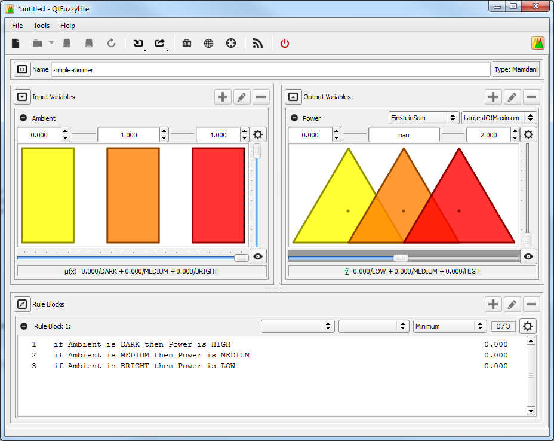

... it occurred that fuzzy controllers might be possible in Processing if a fuzzy library was imported.  I opted to try out [jFuzzylite](http://www.fuzzylite.com/java/) as it appeared more compact than [jFuzzyLogic](http://jfuzzylogic.sourceforge.net/html/index.html).
I built the jar using ant and then imported it into a Processing sketch.  Just use "Add file" menu thus:
[](./addfile.png)
The modified example is coded below in Processing.  Quirk is it opens a small window (as expected) but fills the console with window event logging - as well as the intended print out at bottom.  So, needs some investigating but the fuzzylogic works.
jFuzzylite is also supposed to work with Android so I will switch the Android mode in and see what happens.  The fuzzy logic will be useful for the omni sensor app as the steering may need to be fuzzy to take account of the possible "noise" in the visual field.
Looking good.  Especially as it has a visual tool to design the fuzzywuzzyness that will export to various formats.
[](./qtfuzzy.png)
Very neat.
 \_\_\_\_\_\_\_\_\_\_\_\_\_\_\_\_\_\_\_\_\_\_\_\_\_\_\_\_\_\_\_\_\_\_\_\_\_\_\_\_\_\_

```
import com.fuzzylite.Engine;
import com.fuzzylite.FuzzyLite;
import com.fuzzylite.Op;
import com.fuzzylite.defuzzifier.Centroid;
import com.fuzzylite.imex.FldExporter;
import com.fuzzylite.norm.s.Maximum;
import com.fuzzylite.norm.t.Minimum;
import com.fuzzylite.rule.Rule;
import com.fuzzylite.rule.RuleBlock;
import com.fuzzylite.term.Triangle;
import com.fuzzylite.variable.InputVariable;
import com.fuzzylite.variable.OutputVariable;

Engine engine = null; 
OutputVariable power = null;
RuleBlock ruleBlock = null;
InputVariable ambient = null;

void setup() {
   engine = new Engine();
   engine.setName("simple-dimmer");
   
   ambient = new InputVariable();
   ambient.setName("Ambient");
   ambient.setRange(0.000, 1.000);
   ambient.addTerm(new Triangle("DARK", 0.000, 0.250, 0.500));
   ambient.addTerm(new Triangle("MEDIUM", 0.250, 0.500, 0.750));
   ambient.addTerm(new Triangle("BRIGHT", 0.500, 0.750, 1.000));
   
   engine.addInputVariable(ambient);
 
   power = new OutputVariable();
   power.setName("Power");
   power.setRange(0.000, 1.000);
   power.setDefaultValue(Double.NaN);
   power.addTerm(new Triangle("LOW", 0.000, 0.250, 0.500));
   power.addTerm(new Triangle("MEDIUM", 0.250, 0.500, 0.750));
   power.addTerm(new Triangle("HIGH", 0.500, 0.750, 1.000));
 
   engine.addOutputVariable(power);

   ruleBlock = new RuleBlock();
   ruleBlock.addRule(Rule.parse("if Ambient is DARK then Power is HIGH", engine));
   ruleBlock.addRule(Rule.parse("if Ambient is MEDIUM then Power is MEDIUM", engine));
   ruleBlock.addRule(Rule.parse("if Ambient is BRIGHT then Power is LOW", engine));
   
   engine.addRuleBlock(ruleBlock);
 
   engine.configure("", "", "Minimum", "Maximum", "Centroid");
 
   noLoop();
}
```

```
void draw() {
   StringBuilder status = new StringBuilder();
   
   if (!engine.isReady(status)) {
      throw new RuntimeException("Engine not ready. "
      + "The following errors were encountered:\n" + status.toString());
    } 

   for (int i = 0; i < 50; ++i) {
      double light = ambient.getMinimum() + i * (ambient.range() / 50);
      ambient.setInputValue(light);
      engine.process();
      println(String.format( "Ambient.input = %s -> Power.output = %s",
      Op.str(light), Op.str(power.getOutputValue())));
   }
}
```
