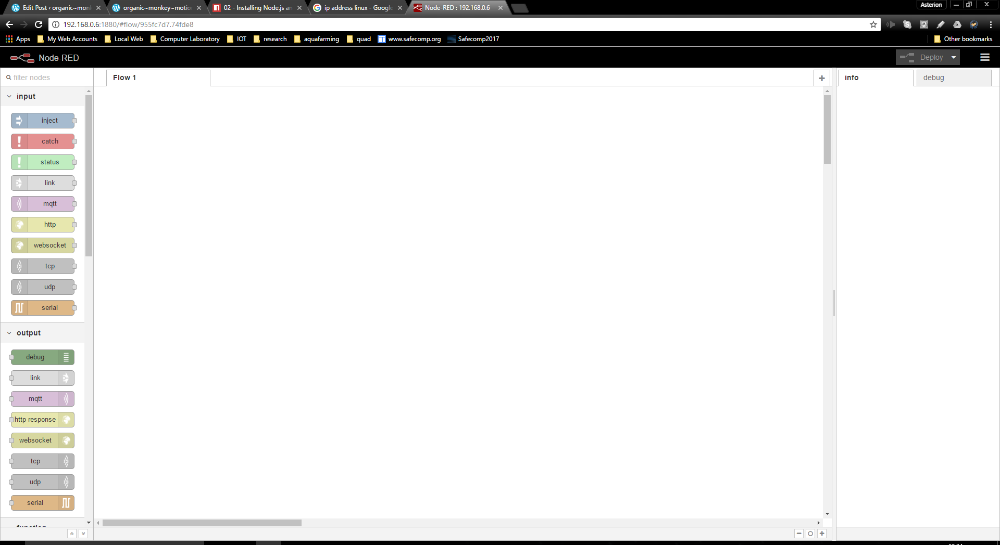

Again with the raft of various authors with their own twists.
So far so good on odrobian vanilla with:
Install npm with:

```
sudo apt-get install npm
```

Install node-red with:

```
sudo npm install -g node-red
```

However, a couple of fails and various warnings ensued so stay tuned for the debug.
DEBUG
Go figure, again with the 1,000,000 authors story.
So far we had to fiddle.
Installing npm installs nodejs of a version that node-red is not happy with so won't install.
I ended up installing nvm to pull latest node.js onto machine.  I then had to use apt-get remove to rip out nodejs/npm installed previously to leave latest node.js along with it's npm.
Voila!

Unfortunately I didn't write the steps down as I was having to slash on the fly to try and work out what was going wrong, why two node were being installed etc.
Having problems with node-red-node-google calendar out??? Same setup works on PC.  The callback provided by node is to localhost.  The odrobian version provides a callback based upon node-red.example.com which you have to resolve to the odroid's ip in /etc/hosts.  The problem, a DNS error is raised at the last step of the "authorise with google" for the API.  The prompt appears, but when you select allow the DNS address error is raised.
