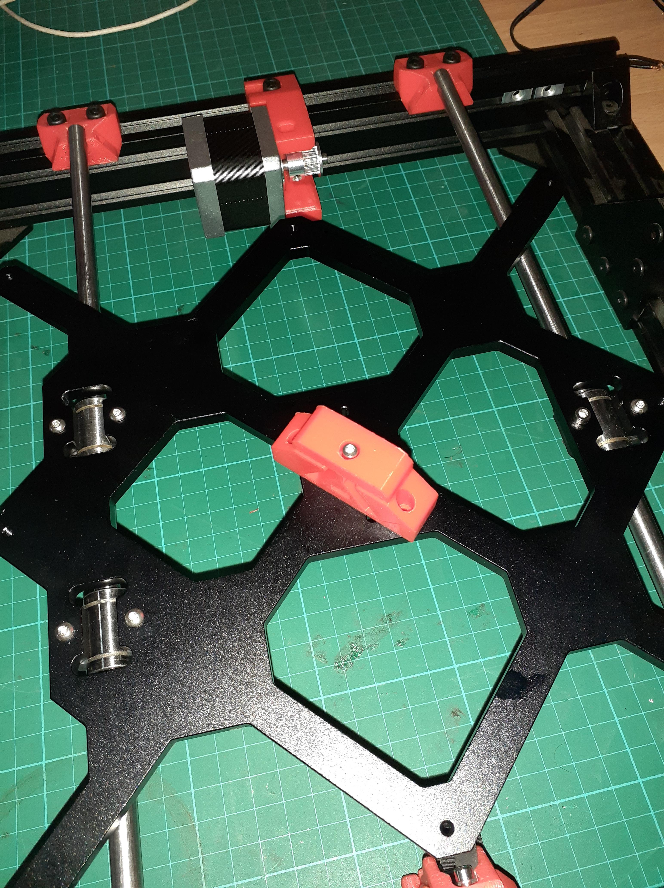
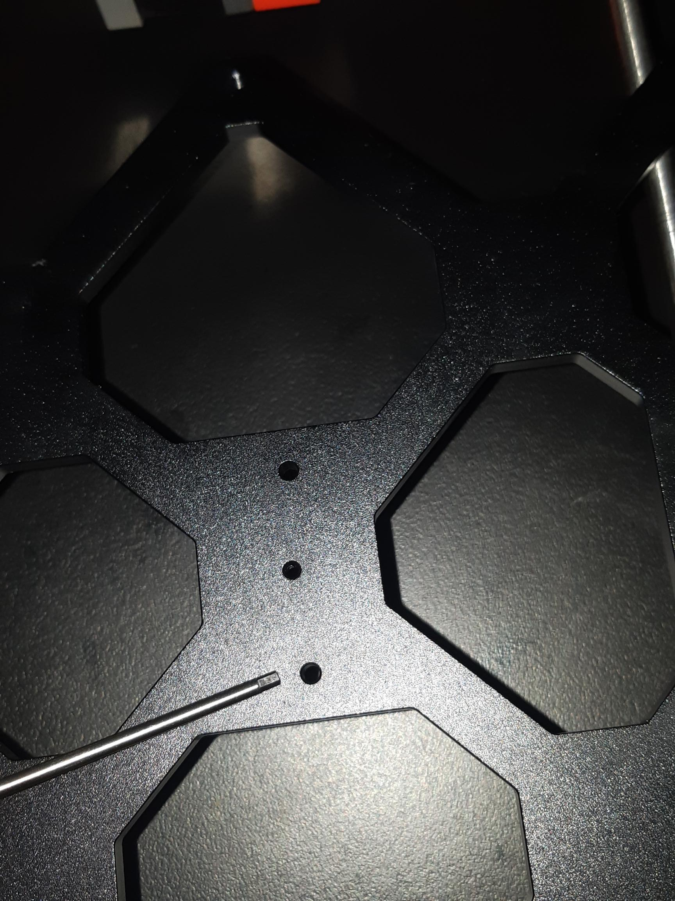

... with Bear Build.

So, trivial problem with time lapse recording of my Bear Build sprints. Failed attempt at fully documenting the sprint to build the Y-Axis below. Turn on Closed Captions, if you don't understand FRACKING RAGING APE JABBERING!

https://www.youtube.com/watch?v=p1p2aZRCue8

What's up with timelapse apps on Android!?

So, outside the pain of trying to fully capture the sprint to the end, we got to here in Figure 1. That is, ready to attach the [y-belt holder](https://guides.bear-lab.com/Guide/05.+Y+axis+motion/46?lang=en#s555).

Figure 1

Have a look at Figure 2. Can you see the problem?

Figure 2

WHAT? You could not tell from looking? I am pointing at it!

The problem is, the destructions read "Install the y\_belt\_holder under the Y carriage with 2x M3x10 (reused from your original Prusa). The grooves should face the dual bearings side."

Why a problem? I did not buy an original Prusa, I am building from scratch with (so-called) Prusa Bear kits or other (so-called) parts for Prusa (but not from Prusa). Risky eh?

So what? Well the hole I am pointing to is not a threaded M3 hole. In fact an M3 screw slips right in, barely (I wanted to say bearly ) touching the sides. Luckily, I have a tap and die set for my M2 through M5 dabbling, so I can swap in M4 screws. There will need be some modification of the holder, though, since the clearances in the holder are for the heads of an M4 and not an M3 bolt.

So, I will start with a hack, and drill out the holder. I am not wanting to re-design and reprint.
