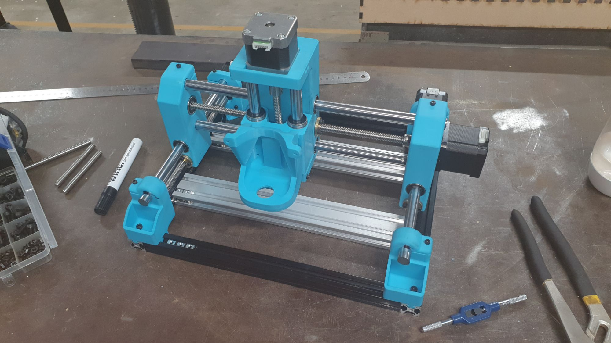

... well almost.

A retired buddy of mine and I have been catching up on my RDO for "play dates" (as me wife calls them) and he lent a major hand throwing this little beast together. I can recommend Jeff as he works for homemade chocolate biscuits and Arnott's Shortbread.

So, yep it's shorter than the original design BY design as I only want a hack to get into CNC. It will certainly (likely) do for small PCB work etc. Really, to spend some time working out this CNC machining thing.

I actually have a Tactix mobile storage cart for hoiking me makes to and from the space AND the bonus is this fits nicely in the [heavy duty tool crate](https://www.bunnings.com.au/tactix-modular-heavy-duty-tool-crate_p0342599) that sits on top of the rolling box.

So, next step is set up [my integration rig](https://organicmonkeymotion.wordpress.com/category/the-rig/) with the BTT SKR Pico (grblHAL installed) and start getting it moving.

First things first, it needs a waist bed. I added the cross members with t-nuts to add a straight board with bracing underneath (as the original idea from the designer of the mill was to pull machine apart everytime you changed out the waist board, which didn't gel as the best idea.).
