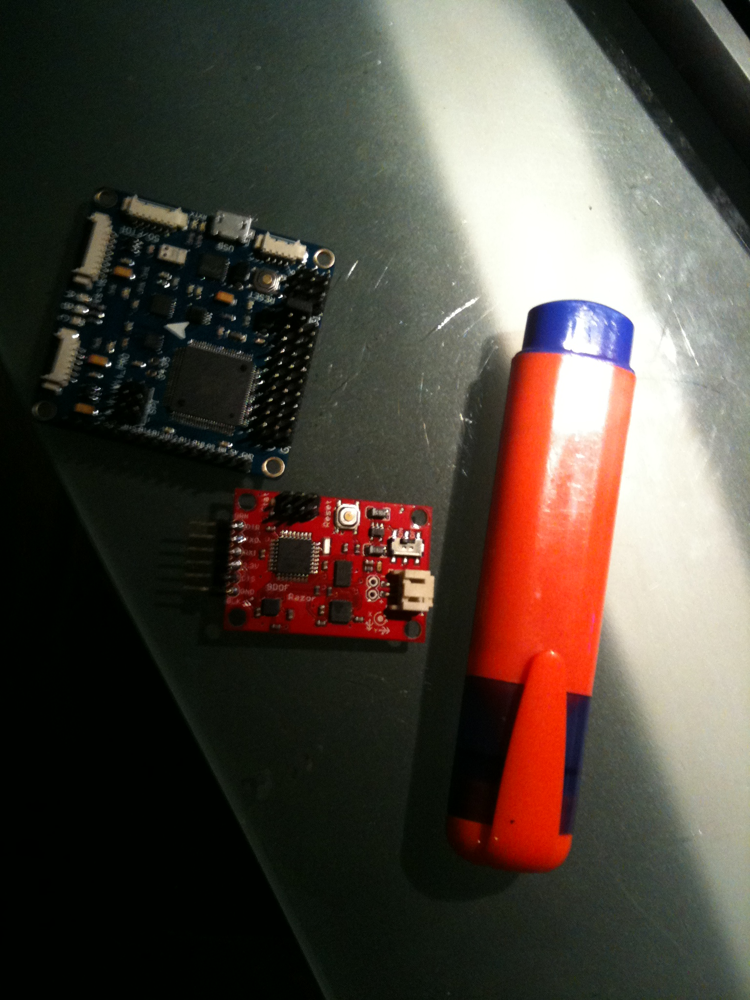

It pours Innovation:

**Features:**
• Supported MegaPirateNG and MultiWii firmware
• Up to 8-axis motor output
• 8 input channels for standard receiver
• 4 serial ports for debug/Bluetooth Module/OSD/GPS/telemetry
• 2 servos output for PITCH and ROLL gimbal system
• 1 servo output to trigger a camera button
• 6 Analog output for extend device
• A I2C port for extend sensor or device
• Separate 3.3V and 5V LDO voltage regulator
• ***ATMega 2560 Microcontroller***
• MPU6050 6 axis gyro/accel with Motion Processing Unit
• HMC5883L 3-axis digital magnetometer
• MS5611-01BA01 highprecision altimeter
• FT232RQ USB-UART chip and Micro USB receptacle
• On board logic level converter

For $48.95

Tiny thing too.

So, go figure.  Scrapping the Arduino Pilots and replacing with this unit.

**POST SCRIPT**

My order turned up and Hobbyking dropped the price of the module by $15 odd so I ordered another two (turns out they left a short track to ground off one of the SMD chips, can be fixed with fine soldering iron and electron microscope!).

The board is about twice the size of a [Razor 9DOF AHRS](https://dev.qu.tu-berlin.de/projects/sf-razor-9dof-ahrs/wiki/Tutorial).

Tiny but packed with 10DOF and the grunt you need for a full autopilot.
