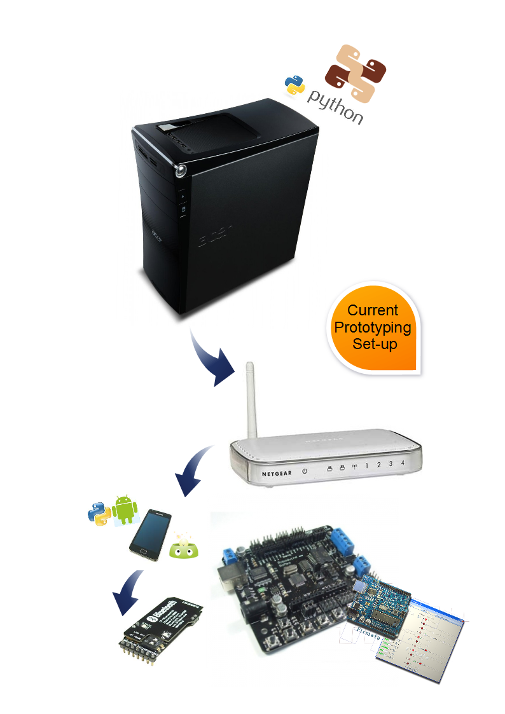

Doodling with POSH and SPADE and it occurred it might get a little hard to debug crashing everything together all at once.
So I opted for something saner.
The idea is the POSH/SPADE agents will run on an Android phone and talk to the Arduino [firmata](http://firmata.org/wiki/Main_Page "Start simple") slave by Bluetooth.
The great thing is I have been writing the Python experiments on my desktop machine and talking to my android-scripting, install on my Samsung Galaxy SII, with my [Stackless Python](http://www.stackless.com/ "Next best thing to CSP and perhaps event active objects.").
So, a few tricks for old players when modifying the firmata arduino.py for Bluetooth.
1) replace "import serial" with "import android"
2) change the parameters to \_\_init\_\_ to a single droid parameter.  This will be the android-scripting instance of the Android() class.
3) Add a method that will connect to the Bluetooth on your Arduino.  The droid.bluetoothConnect(xxx) needs to use the universal UUID for serial connections, namely: xxx = '00001101-0000-1000-8000-00805f9b34fb' - you need to call this to get a serial connection.
2) JSON calls baulk at chr(x) to build strings for the Bluetooth as it expects utf-8.  Minimal code change was to go from:

self.\_droid.bluetoothWrite(chr(mode))

to:

self.\_droid.bluetoothWrite(unichr(mode).encode('utf-8'))

So, I seem to have got the Python (on the PC) connecting to the Bluetooth module on the Arduino, via the Android phone.  Closed up shop for the weekend so I was happy the Bluetooth modified Arduino class seemed to run (mostly) like the original serial version.  Needs some more testing though.
The point being, I should be able to drive the Romeo AllInOne on my cheap truck chassis without moving away from firmdata for a while - doubly remotely skipping through phone from PC.  I have been using firmdata, over USB serial, to buzz out the winch servo I am fitting to it to give it more refined steering than came with it.  So first test will be to see if I can do the same over Bluetooth.  Next will be to take some of the romeo examples, in processing, and convert them to firmata calls from python.  This will allow a basic cell bot with firmata at bottom end and a python abstraction - for now.
Anyway, the current setup up is:

