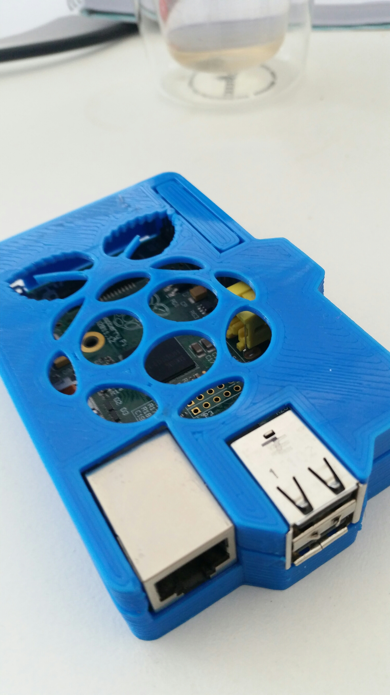

... now I can free one of my ODROID-W up from the chore of being the Thing-a-me-Box.

I will even relent and use thing-a-me-box out-of-the-box.
POST SCRIPT
Or not.  Downloaded thethingbox 2.4.0.  Burnt SD card.  Lights flicker but nothing is home on [thethingbox.local/](http://thethingbox.local/) ... so the slow painful debug.
First option is I will reburn SD with 2.3.5 before I start attaching terminals etc.
I can't see the raspberrydoodlepoo on the network even though it is wired up to my wifi extender.
The eth cable I am using is fine with BBB etc.
My PC is wired to the extender so it isn't the extender.
POST POST SCRIPT
2.4.0 was a dud!
2.3.5 runs fine.
Installability was a quality attribute applied in old world notions of software quality.  Nowadays who cares right, just make the user fluff about.
POST POST POST SCRIPT
Spoke too soon.   2.3.5 loaded up into the gcu page.  Asked me to add email address, passwords, change thingy name.
I hit submit.
It went away and now ... does not connect against default name OR new name.
POST POST POST POST SCRIPT
Would you believe you should not believe the boot times proffered for a raspberry pi, especially when it is running TheThingBox.  Somewhat greater than 50 seconds was the problem.  Go a grab a cup of tea closer to the time.
