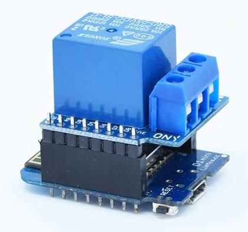
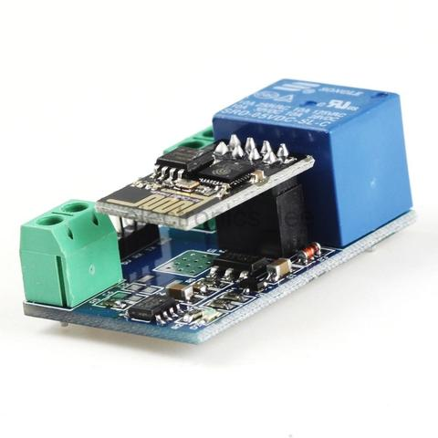
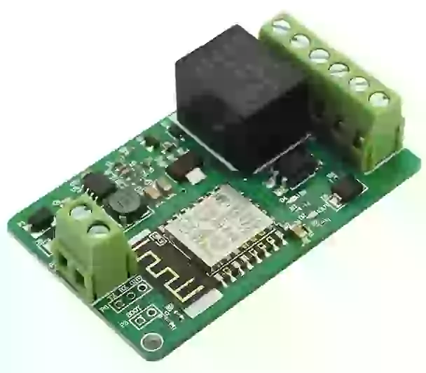
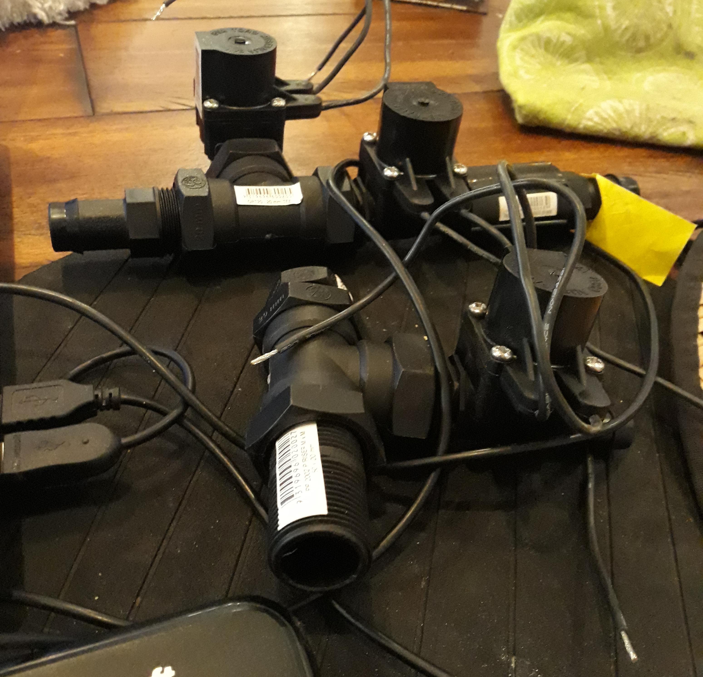

So, I have been running around in circles, trying to get a red-node server running on an OPiZ. The OPiZ would, however, keep spitting it's LAN connection after a week or so.
I almost went back to waste one of my ODROID C1 on the task.
I even bought a Raspingdoodleberry Pi 3B+ to run thingybox. That was a laugh. The thingbox crowd didn't have a 3B+ distro at first, then released a dockerised version of the thingbox that runs on the 3B+. That dockerised version of the thingbox, however, does not save config settings, does not save node-red flows between restarts and otherwise needs you to break into the docker image to install flow dependencies. All without any documentation or help.
The OPiZ had an older version of armbian on it. I had given up fiddling getting mosquitto built on it so I built the MQTT server using eqttd on top of erlang.
So suspects on the OPiZ were hardware (again), the armbian or purhaps either of the MQTT or node-red servers running on it. If I had to pick the original problem I would pick the older version of armbian which was likely still under test at the time.
Frustrated with the failure of the Raspingdoodleberry Pi I gave the OPiZ another shot.
With the latest armbian bionic, snap installed, mosquitto MQTT server via snap, and hand build node-red it has now been up a month.
The node-red snap image is in beta but while it snaps in place, it does not start a service so you need hand start it.
So, I hand built node-red again (since I am such a hand at it ;).
In any event, I got platformio up on my Debian laptop, sorted talking to NodeMCU 0.9 and WeMOS D1 R2 boards. I then coded up a opensprinklette arduino based version for a single relay/sprinkler. The reason I started with a single relay version is the there are a range of single relay options using ESP8266 including:
**WeMOS D1 mini and shield**

**ESP-01 and relay board**

**All In One**

I have a dozen WeMOS D1 mini and relays but I did splurge and get four of the "All In One". The trick with the watering system is that they use 24VAC. So, a simple regulator and you can pump the 24VAC into the "All In One" to be the solenoid controller for a single irrigation solenoid.
I also got myself a couple to three solenoids and bits enough to build a manifold.

