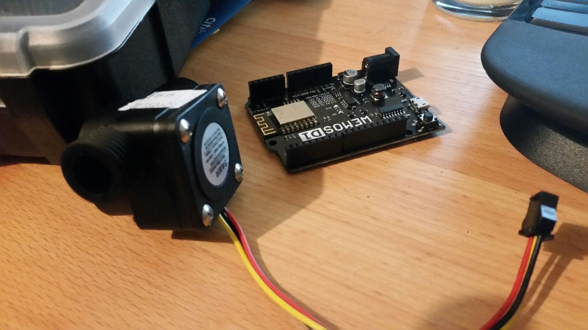
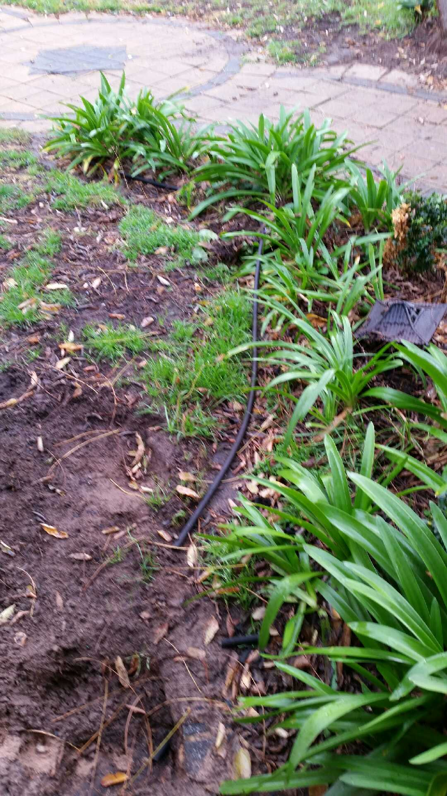

So the four-4-US$12 flow sensors have turned up.  The minimum measurable flow rate appears to be 1 litre a minute.  To put this in perspective Bob Hawke (ex Australian Prime Minister) sculled a yard glass (1.4 litre) of beer in a record (for the time) [12 seconds](http://www.australiantimes.co.uk/hawkes-legend-the-true-story-of-the-yard-glass-yarn/).
In comparison [irrigation "emitters" tend to be in the ranges of](http://www.irrigationtutorials.com/drip-irrigation-emitters/):

* 2,0 liters/hour – 1/2 gallon per hour
* 4,0 liters/hour – 1 gallon per hour
* 8,0 liters/hour – 2 gallons per hour

Now this will be per emitter so you will need around 8 times 8,0 liters/hour "emitter" in a line to get a 1 liter/minute flow by napkin scribbles.  A whopping 30! 2,0 liters/hour "emitter" will be needed to get a 1 litre/minute flow in a line.  Note, there may well be more than enough "emitter" to turn the paddle but that will depend upon the individual installations.
Not really a problem as the intention was to use this as a leak detector as the rate will be driven up but the leak, especially if your dog has dug up and chewed through a hidden hose, as evidenced by ...

... mind you that one didn't need a leak detector to find.
These sensors are advertised as low precision in any event so really not a problem.  So this won't be of use to meter your water usage.
I am playing with the idea of higher precision flow sensors - to set time-versus-budget constraints  - but I will roll that in as a separate option as such a flow meter can likely go on the input rather than output lines, and as we are using MQTT the high precision flow-sensor can also be separate unit to the valve controller/line flow sensor.
All the signal integration will occur in the main host.
