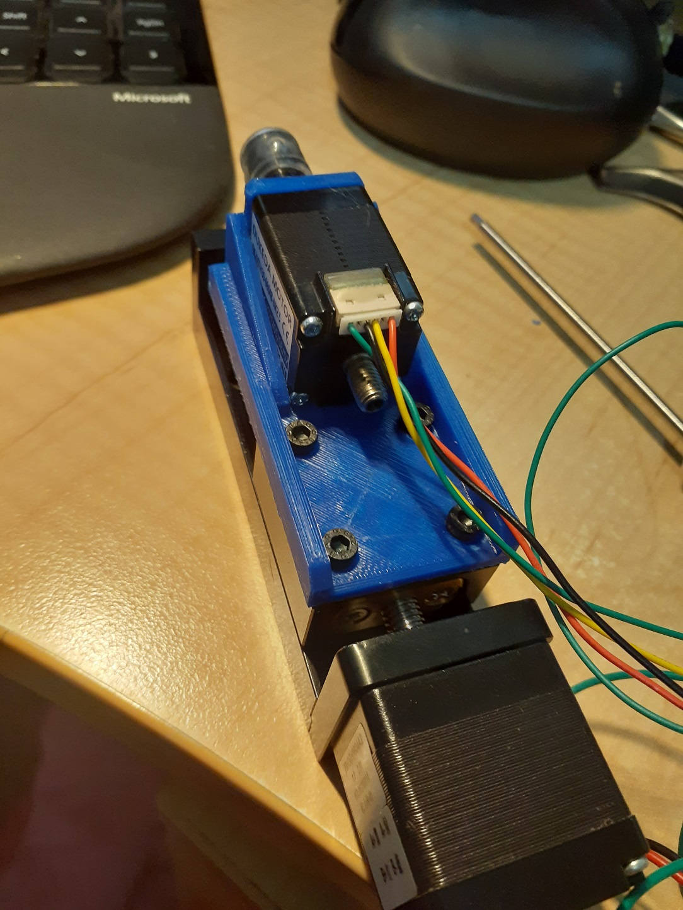

Tracked down [150mm x150mm x 3mm insulation plate](https://www.ebay.com.au/itm/124668842387). Ordered that and a [160mm x 160mm 12volt heated plate](https://www.aliexpress.com/item/1005004110358095.html?spm=a2g0o.order_list.0.0.36891802s171cr).

The aim being to get a dang blasted heated bed into my FlashForge finder, as I am getting FRACKED OFF as I am trying to print the second half of my x-axis for my corexy PnP machine, and I am getting birds nests and all sorts of FRACKING problems with the PLA not sticking to the bed.

Or is it the blue PLA from FlashForge?

The hollow stepper holder in Fig 1 took 4 goes to print, with various orientions tried on the bed before it "happened". When it "happened", it was joyous AS all the FRACKING HOLES WERE LINED UP PERFECTLY! The motor pressed in ever so SNUGGLY!

Still, there appeared no rhyme or reason for the problems I was having.

Was it, I wonder, the glue stick I have been using?

[In work aspects](https://www.thingiverse.com/thing:5446190) up at thingiverse.

Fig 1
