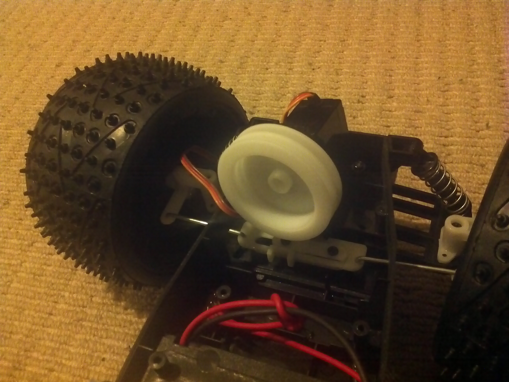

The RC sail boat servo turned up.  Phew! ... on a number of counts.
I guess I didn't have a sense of the size of the thing when I ordered it AND was always curious how I would mount it.
Turns out is is relatively large BUT if I cut off one of the mounting flanges the thing will araldite or double-sided-taped in place AND it will EXACTLY fit into the nook in the front of the chasis.  The "winch" is large enough to clear the rack steering AND the "winch" lines up exactly over the rack.

Above it is loosely dropped in to give the idea.  A small amount of "surgery" will be required to fit it.  The pulley has a couple of small holes in it so the pulley cable won't slip.  The 360 degree motion is more than what is needed but I thought it might help if some amount of auto calibration is required.  I am thinking of something as simple as a black spot on the rack (look beneath the pulley) and a means to find the SPOT (apt since this is a dog chaser).
