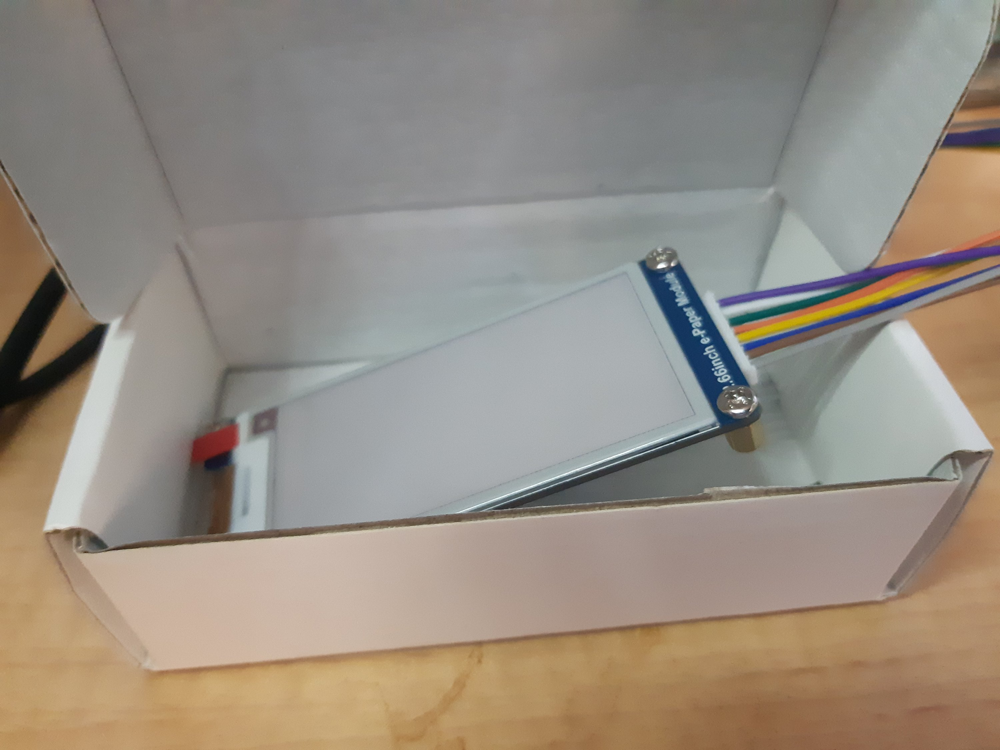
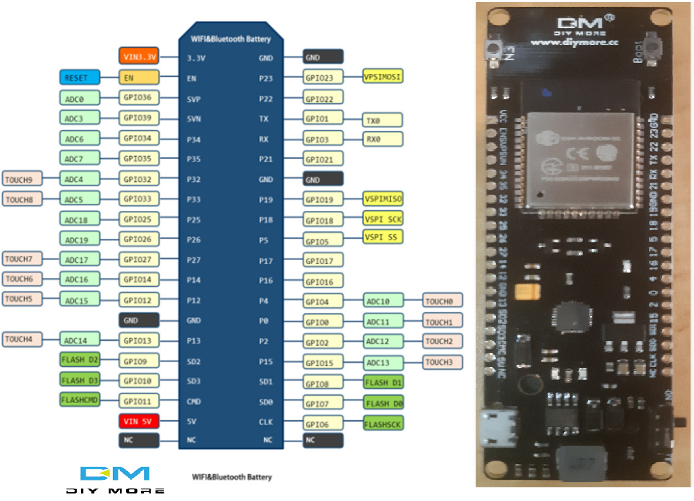
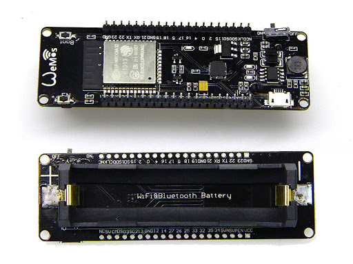

e-Paper!

2.66inch e-Paper module by [WAVESHARE](https://www.waveshare.com/) and from WAVESHARE directly.

So, can now build my planned gadget for my [occasional sensors](https://organicmonkeymotion.wordpress.com/2021/02/10/universal-instrument-host/).

To pair up with one of my [diymore ESP32 boards with 18650 battery built in](https://www.diymore.cc/collections/esp8266/products/diymore-wifi-bluetooth-esp32-18650-battery-development-board-module-ap-sta-ap-for-arduino-lua).

Really a copy of a WEMOS widget. So take note the ESP32 from Diymore uses "wemosbat" as the board when working in PlatformIO.

Tentative first steps, as I had Lua-RTOS running on it. Demoting to Arduino via PlatformIO to keep the problems simple. It won't be a real-time application.

Got Blink running.

At the moment, I am stuck since the GxEPD2 library does not support the display I bought and there is some hacking to write your own. I did find someone on Arduino forum from circa Dec 2020 who had same display so I have PM'd that body to see if they did sort that out. Otherwise, what a pain.

Looks like you need to it the other way around. Find a library and buy displays to match the library.
