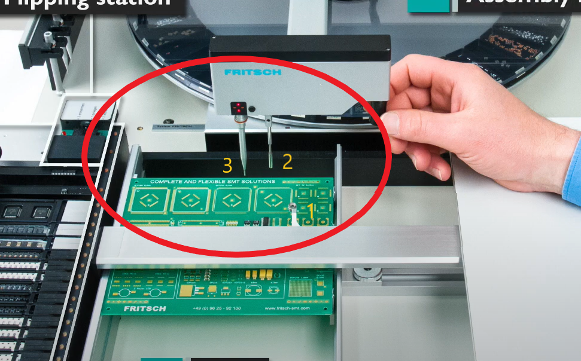
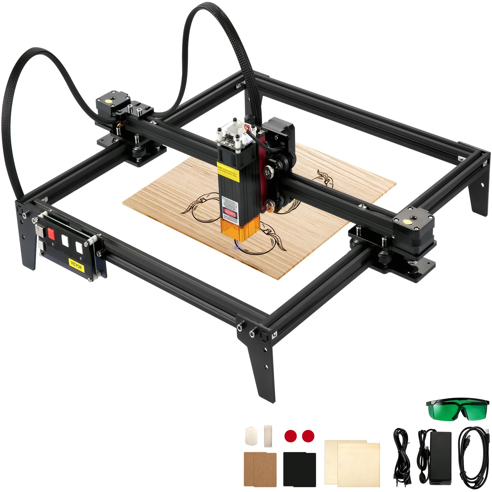
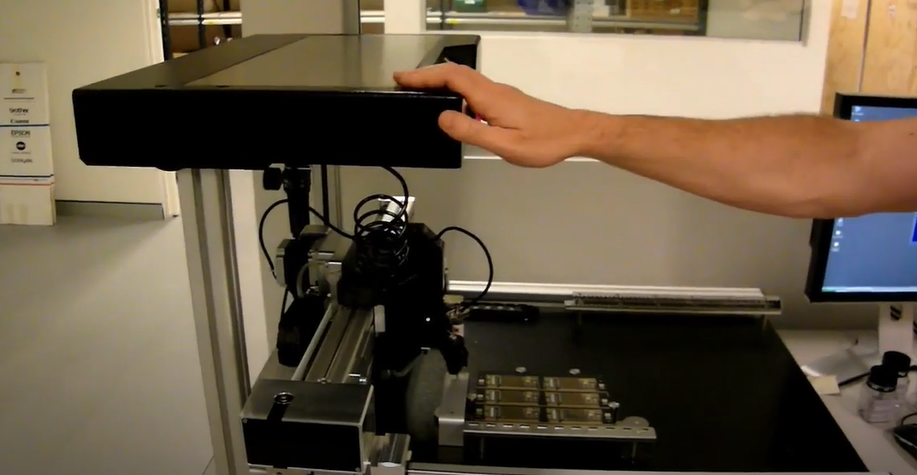
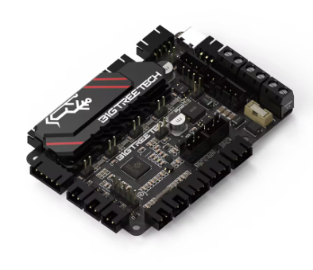
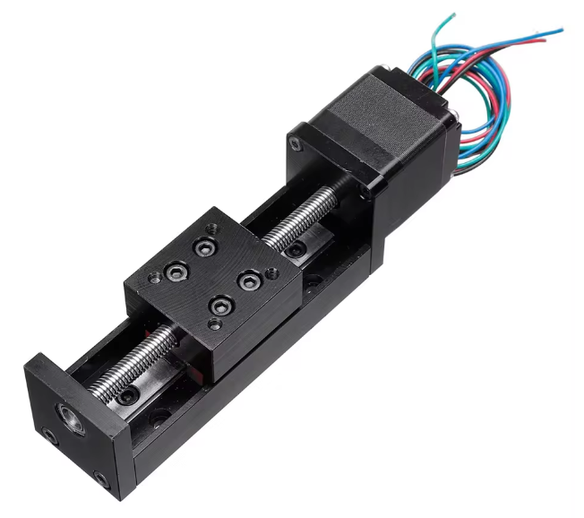

So, I still have too many projects going.

SO WHY NOT ANOTHER ONE?!

So, notice the xy gantry just has a "loop on a stick" (at 1) to line up the post (2) which sets the position of the pick and place head (3). Really, the pick and place head is really interesting on this one, it rotates, as you'd expect, and via manually moving the carriage over a camera. Tricky.

I had been mulling over this, in the back of my mind, for some time. It would be half way between my manual pnp setups and the automated pnp I am still to get to assembling.

The reason I am posting is, VEVOR took 71% off the price of a 5.5watt desktop laser cutting. So, I couldn't build this DIY for the price!

I was after a laser for experiments in weeding cracks between the tiles in the pool area any old how.

Some rework of the widgetry required, of course.

We're up for it, aren't we?

Or, a soldering (iron) robot?

At least a solder paste robot, based upon...

Full video at:

https://www.youtube.com/watch?v=jSZbkR9vNzI&t=31s

Now, coincidently BTT SKR PICO V1.0 were going for 66% off. So, that's in the mail. I think I've a RPi to drive the Kilppered PICO.

With something like this as the "extruder"

As it happens, I already have 5 boards from PCBWay for that solder dispensor, as that can also fit the manual PnP.

Mitt one of these as the z-axis

At the mo, the presumption is the dual z-axis out of the PICO will need be recoded as dual x or y axis etc. Or, some config required, yadda.
