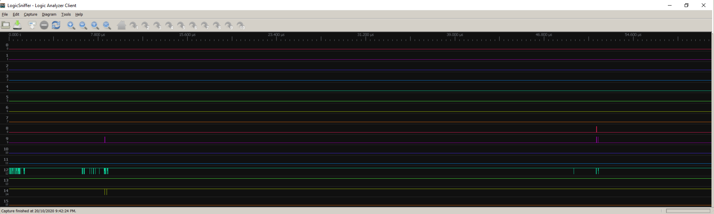

So, whether the procurement ages of ago of a [logicsniffer](http://dangerousprototypes.com/docs/Open_Bench_Logic_Sniffer) was a good idea is up in the air. Looks like the version I purchased has been left behind in the firmware upgrade stakes.

Noting also, others have long reported the problems with firmware updates and there has been no fixes offered.

But I also note some of the traffic on the "help" groups is stale, old. So, may not be able to recommend the gadget, that being moot since its now a dead project.

It also looks like there is a problem with noise. You only catch it occasionally, but if you look for it it's there.

Now this happens with the thing running, not connected to anything so leads unattached. Given its an open board, with no shielding on connectors, you might expect some noise ... I suppose.

It may be dangerous to play with the prototypes of others.
