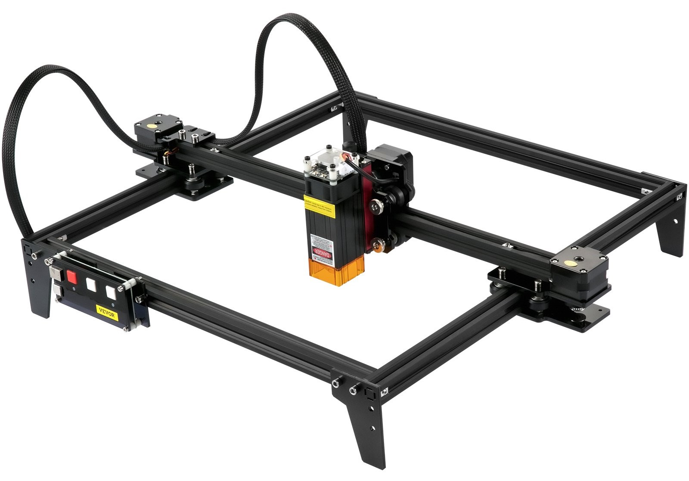
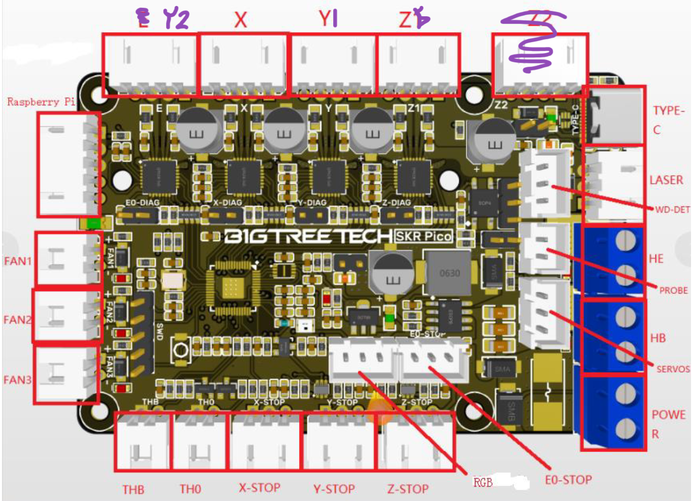

Since a [solder paste robot](https://organicmonkeymotion.wordpress.com/category/solder-paste-robot/) is being hacked up here, I may as well do a little bit of musing.


Since I am using the [BTT SKR PICO V1.0](https://organicmonkeymotion.wordpress.com/2024/08/13/pico-is-tiny/), we know that has Klipper support as the main "engine" for 3D printing.


You can, in fact, get ideas for 3D "printing" of solder paste ([rpt2paste](https://github.com/hzeller/rpt2paste) for example). Along mitt mods to your 3D printer (apparently). We note, rpt2paste assumes you've hack a 3D printer using a pressurised air, with a solenoid driven by a "fan out".


The other option seems to be OpenPnP V1.0, but not OpenPnP V2.0, driving a grbl.


[](./hamster-wheel.gif)


The story goes there is a kludgy solder paste dispensor approach in V1.0, but not enough people using it. So its been dropped from V2.0 as "too hard". Although there is some (not a lot) of chatter around OpenPnP using Klipper (an idea apparently, not tested).


What to do? Hmmmmmm?


The BTT SKR PICO has the layout in Figure 1, so it has a "ganged" Z axis (really one driver driving two steppers). With "E" being "Extruder" of course!


[](./download-2.png)

Figure 1


But again we're using a "ganged" Y axis laser cutter, in Figure 2, and so some "adjustments" are in order. The lazer will be replaced by a linear Z axis, [as discussed previously](https://organicmonkeymotion.wordpress.com/2024/08/02/ive-been-soo-bad/).


[](./vevorlaserengraver-1.jpg)

Figure 2


Hence, NO RULES!


I was thinking I needed to be a good citizen and repurpose the Z1Z2 as Y1Y2 and therefore Y>Z.


Gossiping with the maintainer of [grbl HAL for the RP2040](https://github.com/grblHAL/RP2040), and whereas I thought I may need hack grbl HAL code, apparently you just select ganged Y and the web builder steals the E as Y2, so with grbl HAL we just drop the Z2 and end up with Figure 3.


[](./download2.png)

Figure 3


Poking around the code, I did confirm that (for my own peace of mind), with:


```
// with the following uncommented in my_machine.h 
#define Y_GANGED               1

// which (along with an alias of same and some other related flags)
// conditionally compiles in the following in motor_pins.h
#define Y2_STEP_PORT        M3_STEP_PORT
#define Y2_STEP_PIN         M3_STEP_PIN
#define Y2_STEP_BIT         (1<<M3_STEP_PIN)
#define Y2_DIRECTION_PORT   M3_DIRECTION_PORT
#define Y2_DIRECTION_PIN    M3_DIRECTION_PIN
#define Y2_DIRECTION_BIT    (1<<M3_DIRECTION_PIN)
```


So, I also selected SPINDLE0 as IN/OUT. I am just a little vague where grbl HAL connects that sucker. Laser maybe? That needs another code trawl.


Otherwise, the "ganged" Z1Z2 ports are a convience since they connect a single drive output to two motors. I'm told, you can as soon connect two motors to a single output port, with the right cable. I think this setup also allows for Auto-Squared (since it is setup as 4 separately driven steppers, and so allowing for separate alignment of Y1 and Y2). At the moment, I think paste dispensing is somewhat a "coarser" application and so ganged is a good start.


AND, go figure. Looking at the grbl HAL code, and then the PICO schematic, SPINDLE0 seems to be connected to GPIO20 which, yes, looks like its driving P17 or FAN3 output. So VCC is either DC12V or DC24V. Nice, I can certainly drive a 12 or 24 volt pneumatic solenoid with that. At least that's what I am getting if I do something like the following in the code (since I want an ON/OFF spindle and not PWM), hence (after poking around in the code):


```
// with the following uncommented in my_machine.h

#define SPINDLE0_ENABLE         SPINDLE_ONOFF0
```


I did also poke around, on the Net, for python or other options for generating gcode. Go figure, even though rpt2paste is in "C", it came up early in a search on "python".


So did [gcmc](https://www.vagrearg.org/content/gcmc).


The difference, rpt2paste takes a KiCAD "module" description and turns it int gcode for a "paste" setup (based, as I said, on a hacked 3D printer). While gcmc is a neat (though is anyone using it) human readable script language, that outputs gcode.


Any old how, those are me thoughts at the moment.
