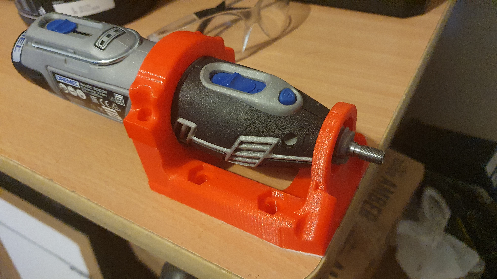
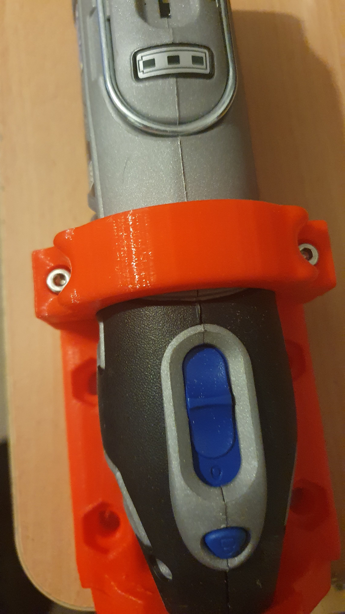
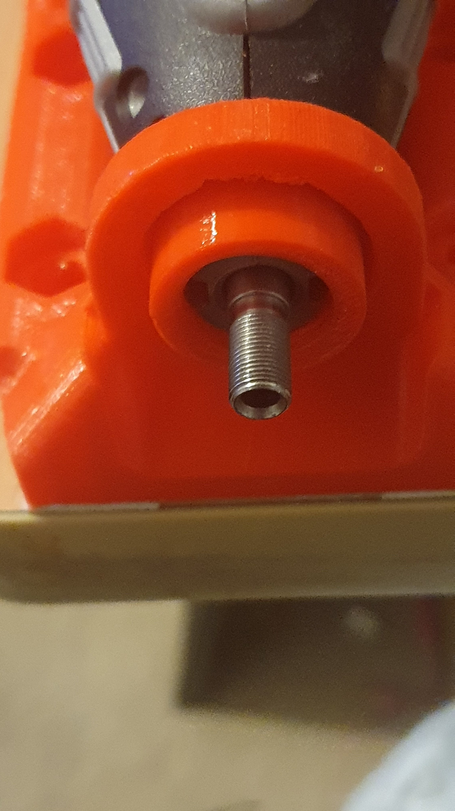

So, I was in the middle of stuff and thought to get a 3D print going. As much to check out the printer, since I had reseated the flat cable on the motherboard, thought I had sorted the printing glitch, then had another half print. But was it the stale black filament?

A fresh reel of red filament seems fine, voila!

And, why not?

Deft use of double-sided tape, rather than drilling holes in the desk.

Thanks pogromcajerzyn for the [design](https://www.thingiverse.com/thing:1505931)! Works on Dremel 4000 (as designed), Dremel 8220 (as in pic above), works with my corded [Duratech drill](https://www.jaycar.com.au/210-piece-rotary-tool-kit-with-flexible-shaft-engrave-drill-sand-polish/p/TD2459?gclid=CjwKCAjwjYKjBhB5EiwAiFdSfsGI5aX6eGMFLynrcAT4hsX2paHCUQrcaMnlOpTwa3y0whcRDVEDfRoCx5EQAvD_BwE), with foam under U-bracket, since its not quite snug enough.

Had to buy 100 M3x30 to get 2 for the clamp. What to do with the other 98?

Made a "nut" to clamp the slightly loose fit in this end
