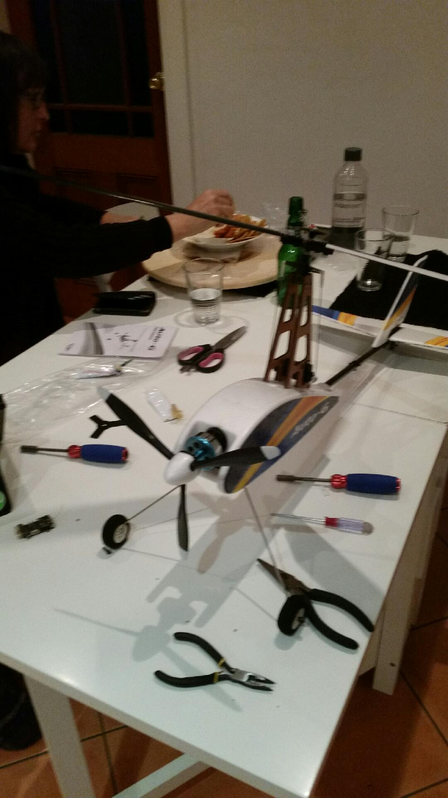
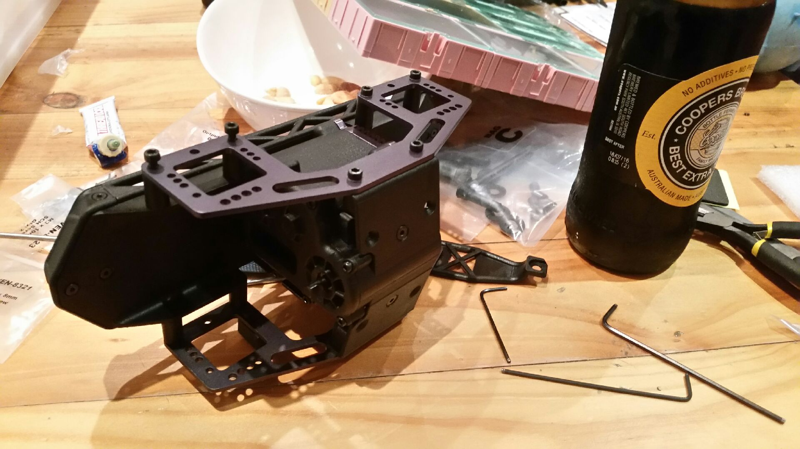
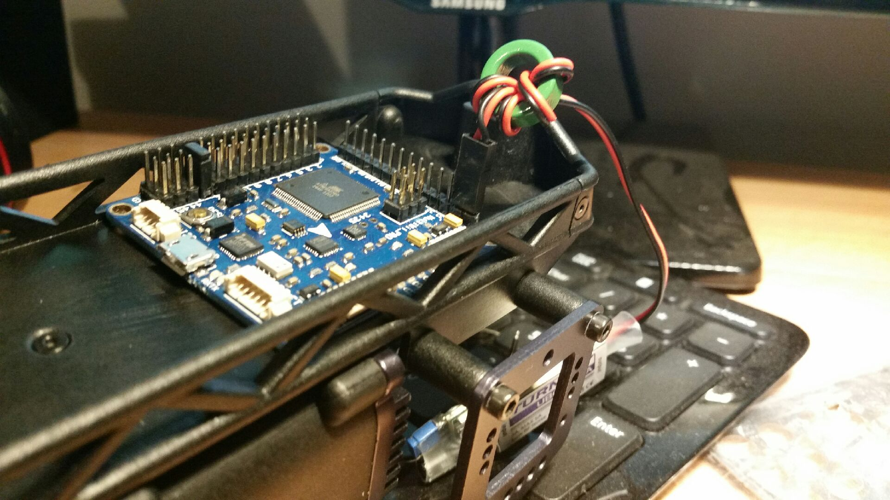

Because it is a long weekend here, the stores aren't open and so we couldn't get up the road to get the loose bits and pieces you find you need along the way when building these Chinese Robocat kits - given the complete absence of complete instructions.
Will need a couple of 3s batteries in any event, more lock nut, some heavy wire for power connections, and ...
So, I got my sister to build the gyrocopter I got on sale from HobbyKing, so voila!

We found the glue that comes with the kit had burst and set some of the parts in a thick goo, much like mosquitoes in amber from the Jurassic period.
In the meantime I progressed that dang blasted rock crawler I was building before my Master's course took over my life, and so:...

Yes, beer and nuts does help with assembly.  If I hadn't lost my prescription glasses that would have helped.  A couple of more expensive hobby alan keys will also help as I have stripped all the finer cheap ones.
Now what wild is that, conveniently, the AIO fits snuggly in the chassis.

Pity though, not the best idea for outside work - which is what the robot will be used for.
The AIO will be the "lower brain" and a Beaglebone Black will be the "higher brain".  You can run [MOOS-IvP](http://oceanai.mit.edu/moos-ivp/pmwiki/pmwiki.php) on a Beaglebone.  Although, the idea of running [Nerves](http://nerves-project.org/) is also then an option, I also rather like the idea of using MQTT as the messaging backbone. But, start with MOOS-IvP first.
 
 
