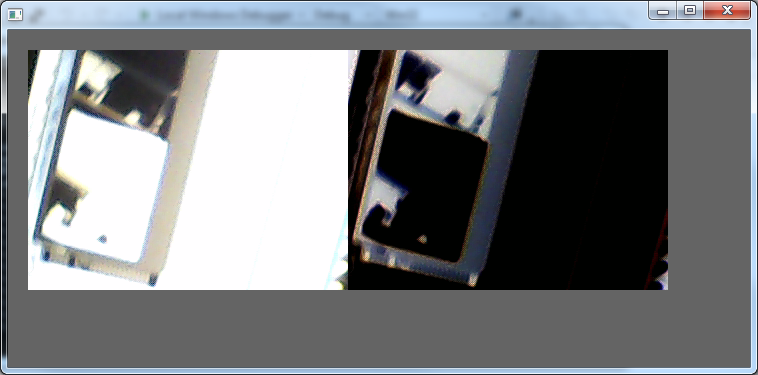

So, I plugged in my recently acquired endoscopic camera to see what it might look like through the omni lens.  Of course, I didn't expect it to work out too well because of the LED light which would flood the lens.
http://youtu.be/ndVpLLq5oSo
I installed VS2012 (doesn't like my Windows 7 apparently but seems to run anyoldway).
So, poked around the examples from [OpenFramework](http://openframeworks.cc/ "Neat and works on all boxes (apparently)") and found one that was a simple frame grabber.  I had to modify it to point at my camera (there is another pesky camera definition on my system which I think was an old clapped out USB camera I tried running that crashed the computer - looks like it didn't install properly, as usual).
Anyway, the result is not earth shattering:
[caption id="attachment\_1139" align="aligncenter" width="450"] Voila!![/caption]
BUT this framework works on linux, windows and android so I can design and implement on my windows box before porting to either of android device or beaglebone.  Pretty neat.
First I will take the OSX example of bloggie unwrapping to work it towards a windows visual bumper.
