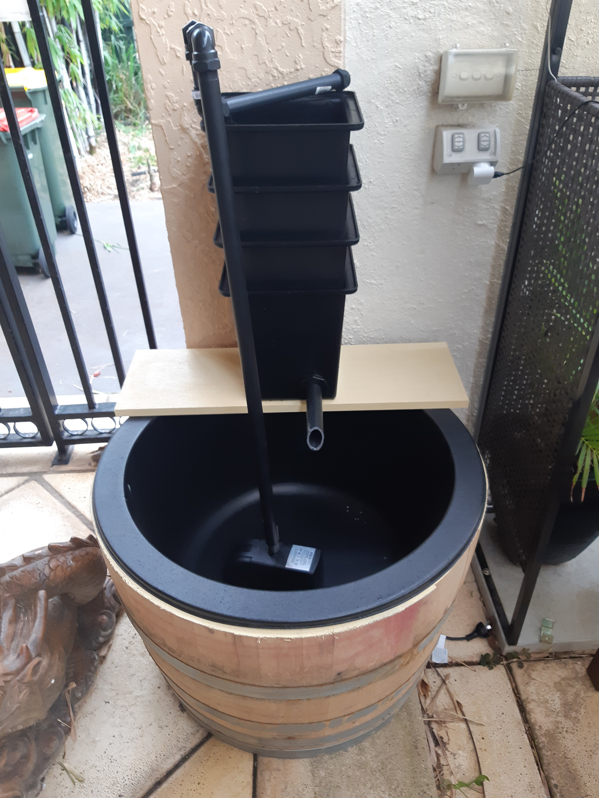
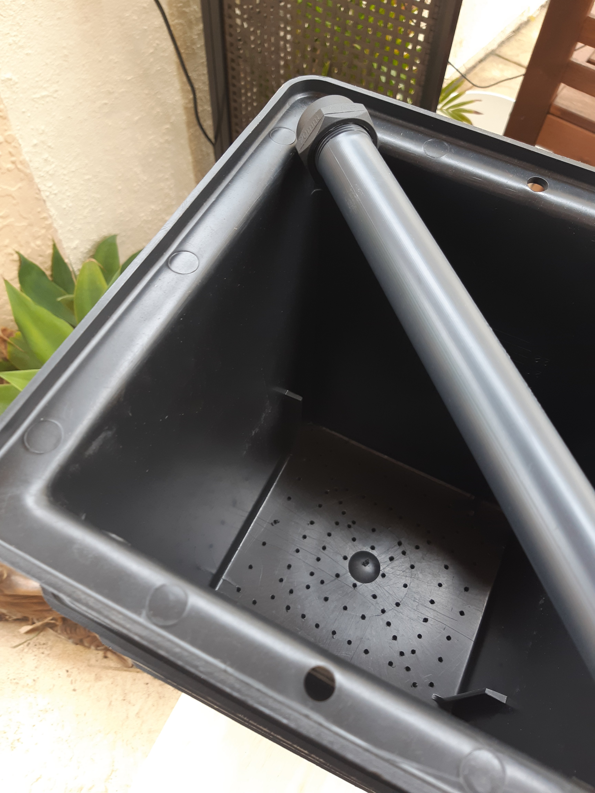
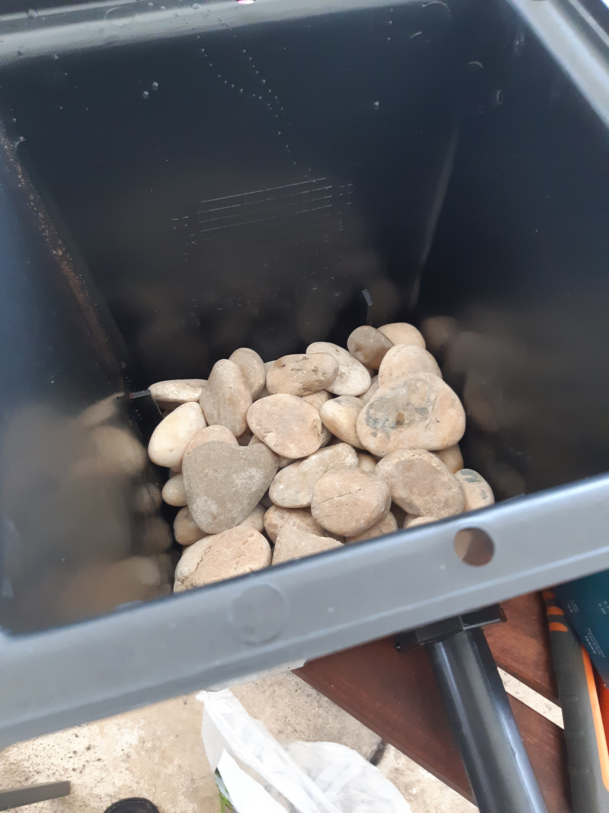
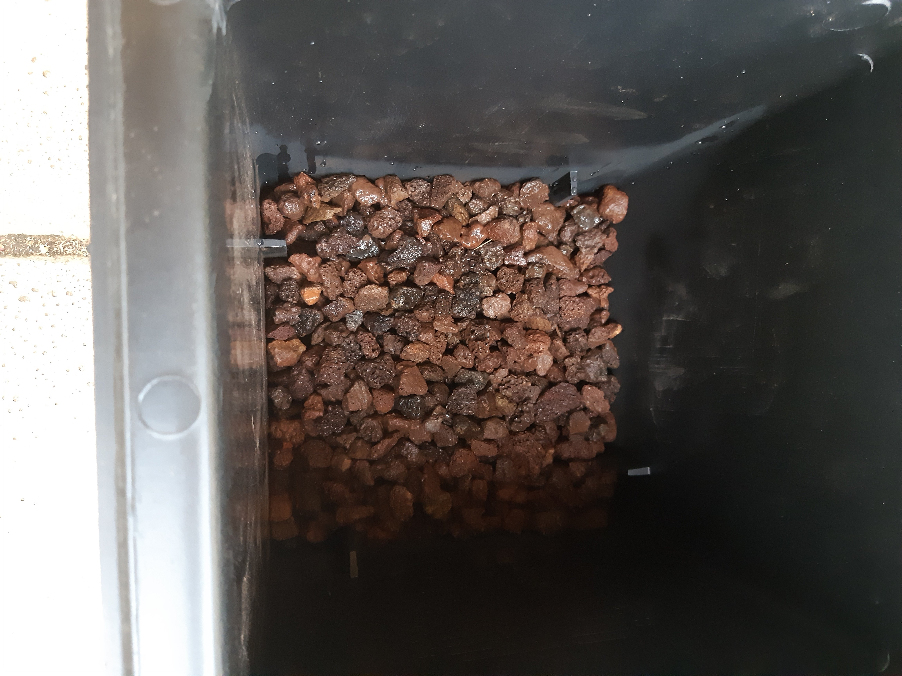
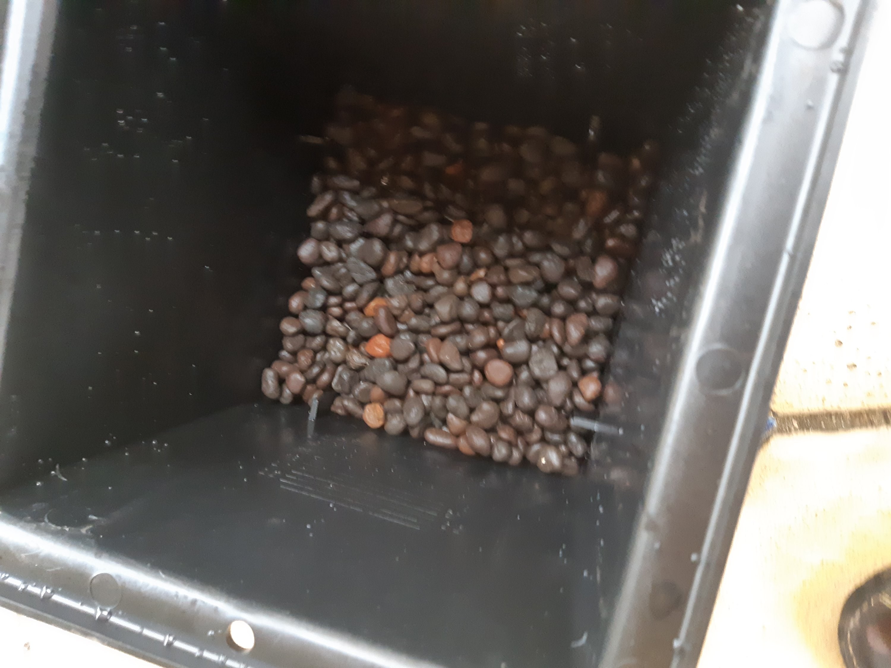
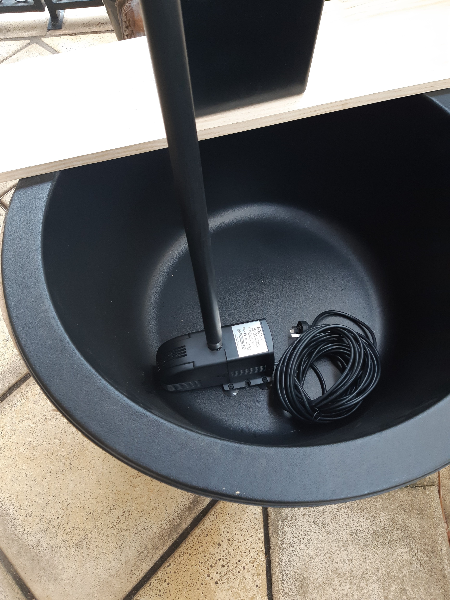
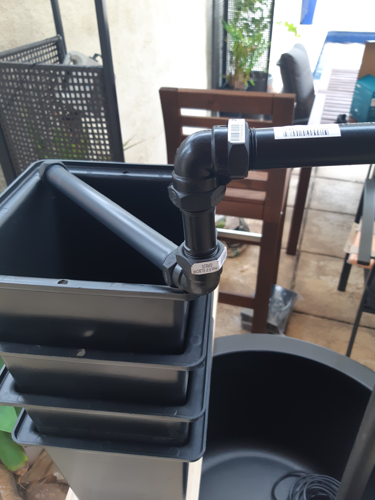

Ages ago, the wife's gold fish were migrated to a plastic tub, outside under the back awning. Happy enough but the large fish tank filter struggles.

So I have built this pond.

Wine barrel pond with small Bakki Shower or Trickle filter

The filter is a take off of the [Bakki Shower or Trickle filter](https://www.google.com/search?safe=active&rlz=1C1CHBF_en-GBAU863AU863&sxsrf=ALeKk01-xvdq4i80khoaXDrR-GjsJj2lMA:1612613497174&source=univ&tbm=isch&q=bakki+shower+filter&sa=X&ved=2ahUKEwi0x6K1ndXuAhVugtgFHZx1ClgQjJkEegQIAhAB&biw=1920&bih=937). The principle is having a number of perforated troughs "raining" onto various layers of material.

The trick is I am using rainwater pits from the drainage section of Bunnings (hardware store).

You will need drill holes in the bottom.

Notice they have flanges which usefully set a nice gap between pits. This means no need for wooden structures to hold the pits apart. Just take care to not fill space to top of internal flanges.

Bottom layer with large smooth water feature stones (below flange level).

Second layer from the bottom with small volcanic rocks (below flange level).

Second layer from the top is fired clay pebbles (below flange level)

Might have over done it with the pump.

The sprayer.

The top trap will have various layers of filter material.

Bill of Materials:

1. [Rainwater pit (x4)](https://www.bunnings.com.au/everhard-easydrain-polymer-rainwater-pit-case_p4770245)
2. [Half oak wine barrel (x1)](https://www.bunnings.com.au/1-2-oak-wine-barrel-timber-planter_p0188392)
3. [Wine barrel liner (x1)](https://www.bunnings.com.au/aquapro-710mm-wine-barrel-liner_p2810305)
4. [300mm x 25mm poly riser (x1)](https://www.bunnings.com.au/garden-rain-300-x-25mm-poly-riser-connector_p4816126)
5. [25mm tank fitting (female) (x1)](https://www.bunnings.com.au/holman-25mm-female-tank-fitting_p4813623)
6. [900mm x 20mm irrigation riser (x1)](https://www.bunnings.com.au/garden-rain-900-x-20mm-poly-rural-irrigation-riser_p3116224)
7. [300mm x 20mm irrigation riser (x1)](https://www.bunnings.com.au/garden-rain-300-x-20mm-poly-rural-irrigation-riser_p3116127)
8. [150mm x 20mm irrigation riser (x1)](https://www.bunnings.com.au/garden-rain-150-x-20mm-poly-rural-irrigation-riser_p3114214)
9. [80mm x 20mm irrigation riser (x1)](https://www.bunnings.com.au/garden-rain-80-x-20mm-poly-rural-irrigation-riser_p3113551)
10. 20mm irrigation 90 degree elbows (x3)
11. 20mm irrigation end cap (x1)
12. [Pond pump (x1)](https://www.bunnings.com.au/aquapro-water-feature-pond-pump-medium_p2820007)

Destructions (matching with the BOM items above):

1. Drill holes into the bottoms of top 3 rainwater pits. I used a 3mm drill bit to start with, so I had room to increase the size if needed. These holes are to allow for the trickle down. According to all the other hackers building this type of filter, there is no science to the holes. In the forth rainwater pit (the one that will sit at the bottom), drill a 44mm hole as close to right and as close to bottom to allow the 25mm tank fitting (item 5 in the BOM above) to snuggly fit. Too far left and you'll collide with the flanges (which are all set on the left of a side). If that happens, your tank fitting (item 5 of the BOM above) won't at all fit properly.
2. You don't need to, but I did opt to drill three large holes (50mm) into the bottom of the barrel. I also gave the top edge and the innards a double coat of pond sealer. This is just in case of spills and accidental floods. This will help stop the barrel from rotting (I hope). Not scene in the photo above, but the barrel will also get a wood stain finish.
3. No special treatment for the liner. Just make sure, when you put it into the barrel, centre it OR IT WILL BUG YOU!
4. The 300mm x 25mm riser (item 4 in BOM above) is to be cut to create the return spout. It will fit into the tank fitting (item 5 in the BOM above). I used a mitre block and cut it at 45o to create the spout. There is no rule really about the length. If you cut the riser a third of the way along, you get two spouts of differing lengths, as the riser is threaded at both ends. Keep the other as a spare, for for a second filter.
5. The thread on this tank fitting is contra to what you might expect. It has a soft seal so leave that seal on the outside. The hole for the tank fitting is 44mm to get a relatively snug fit. A little tighter might be apt, to then allow the male thread to be threaded into the tank.
6. As luck would have it this length was perfect! Perfect since an 80mm riser (item 9 in the BOM above) was able to lower the sprayer (item 7 in the BOM above) to contact the top of the highest rainwater pit (item 1 in the BOM above). I did get caught out with the pump (item 12 in the BOM above). Caught out because the pump said it had 20mm fittings and the irrigation was also supposedly 20mm. Turns out the 20mm irrigation pipe is 20mm internal so the pipe does not fit directly into the pump! The pump fittings are 20mm external. OH NO! Phew. There was a fitting on the pump that had a hose fitting. That, with a gentle but firm hand, actually press fit into the the pipe.
7. The 300mm riser is used as a sprayer. The rainwater spits (item 1 in the BOM above) are actually around 300mm in diameter. So this worked a treat. I was otherwise planning the more traditional rectangular sprayer. That option is still available but I suspect, given the mini size of this system, I won't need be that fidgety.
8. There is no rhyme or reason for the 150mm length of this. It could be longer or shorter. It is obviously needed to set some distance of the pump from the shower system.
9. Again, this magically drops the pipe work to the top of the highest rainwater pit (item 1 of the BOM above). Most all of this was accidentally on purpose. The 20mm pine shelf helps. The size of the pump helps.
10. As we are only using a diagonal sprayer, only 3 elbows are needed. More would be needed if you opt for a rectangular sprayer.
11. The end stop, don't forget the end stop. You'll need back pressure.
12. The pump will lift to 1.5m. It may be too big. The rig is 900mm so the small unit, which will lift 1m, would likely be okay. Being smaller you might need put packing under it to lift it. Note also, depending on possible failure modes, placing a small pump on a block might help if something goes wrong and the piping comes adrift and water gets pumped out of the pond. You'll need some water in the bottom to save the fish until you find the problem. Note, if the pump stops the Bakki Shower Filter will drain back into the pond. So the pond should not really be filled to the top. The filter may look like it has large capacity BUT each of the three lower rainwater pits only have about 10cm of space and that is occupied by rocks of various sizes. The top pit will be full of various filters. In the end, I have drill holes into two opposing corners of the top rainwater pit, so as to cable tie the sprayer down. This will also push down slightly on the pump, which gives me some comfort since the 20mm ID irrigation riser is only press fit over the 20mm OD fitting. It will also stop the pump from coming loose off the bottom.

I am on the look out for plastic mesh bags. I have seen some filters were the rocks are in plastic mesh bags, which makes sense if you want to clean out the filter - you just lift the rocks in/out in the bags. I do note the pet shops do have the mesh bags, at a premium price. Whether the $2 shop has them is the thing. Worth keeping an eye out.

However, the system easily comes apart for cleaning. Just need to snip the precautionary cable ties.

The volcanic rocks especially, but also the fired clay pebbles, are there to create biological filtering. Good microbes should be growing in those layers. I grabbed the fired clay pebbles as they are designed for aquaponics. There will also be a special filter stage in the top with deals with ammonia (if not nitrate).

The larger rocks in the bottom are their for ballast and won't offer too much additional biological load. I am toying with the idea of oyster shells as an alternate. Another thing might be to add an aerator to the bottom pit. Still things then to fiddle with.

Currently, in the top rainwater pit, I am to have a carbon filter pad, ammonia filter pad, fine and course pads and aquarium wool in the top filter. Layers are (top to bottom):

1. Course pad.
2. Aquarium wool.
3. Fine pad.
4. Ammonia filter pad.
5. Charcoal pad.

I believe there is also a nitrate pad around.
