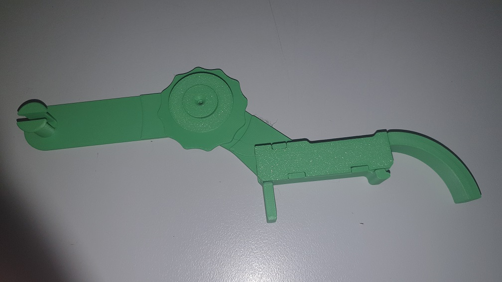
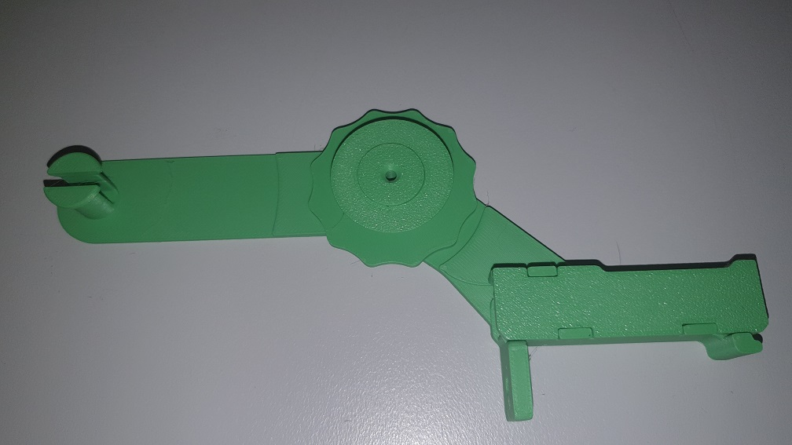
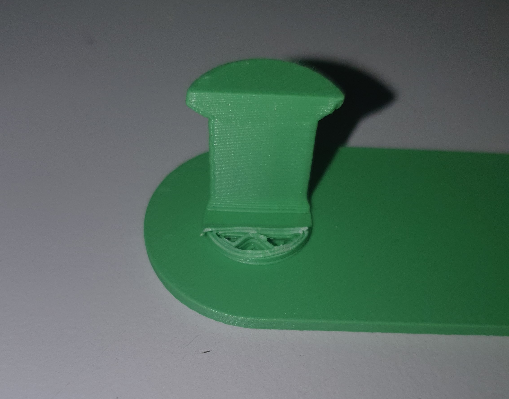
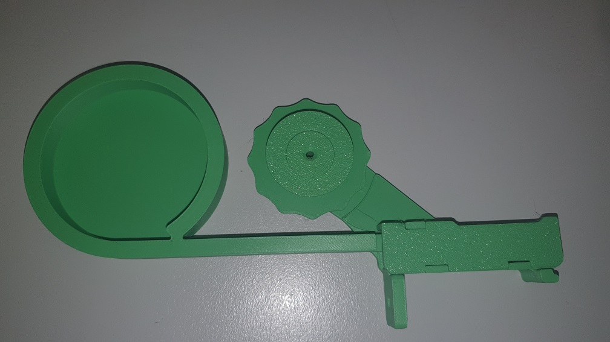

A couple of options that hold 100mm reels (so you don't need a second rack).

With "snout" to direct empty tape down

Without "snout"

It turns out I didn't, however, think through the post for the reels. The flange is too big, by a long shot, and so it broke off.

Back to the drawing board, er FreeCAD. Should be a simple fix.

Here's the one with 60mm "magazine" for strips too short for reel but nuisance length for strip feeders.
