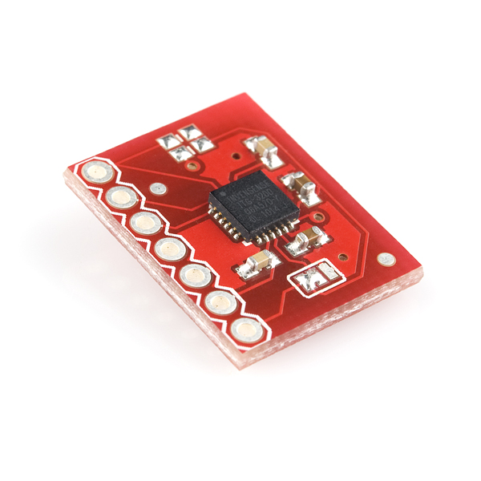
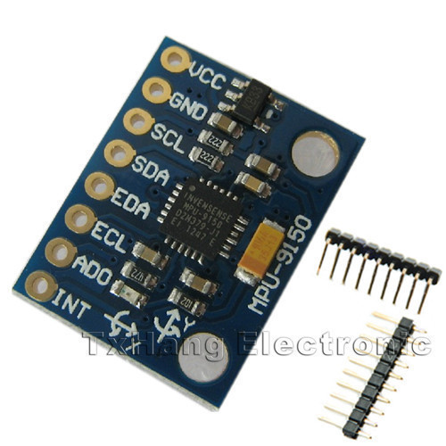
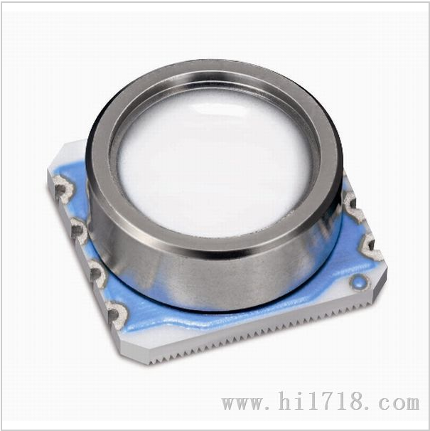

... and still I need to cut up my VISA card
*[audience: NNNNNNNNNNNNNNOOOOOOOOOOOOOOooooooooooo!]*
Okay, I won't.
So, I jumped on net to find a MPU-9150 breakout as I have started soldering up the propeller proto board to take the ITG 3200 for the [phubar](http://organicmonkeymotion.wordpress.com/2013/07/07/what-a-coincidence/ "What a coincidence") experiments.

I am going to add two sockets to allow swapping out between the two sensors.

Found a 9150 breakout for $16 odd dollars (although buying 5 for $50 was tempting).
In the meantime found a depth sensor with apparently 1cm resolution, 5 for $20 plus $8 postage.

(Post script: the seller retracted the sale, they put the wrong price up - too good to be true afterall.  They don't appear to be subject to Australian law and not means to force them to honor the "contract").  You are looking for the [MS5803-14B](https://github.com/vic320/Arduino-MS5803-14BA "Code to go with sensor") .

This will do for the submersible experiments with the old video camera diving houses.  Of course, some has already written Arduino code to use exactly this sensor (gotta love open source ... sometimes).

