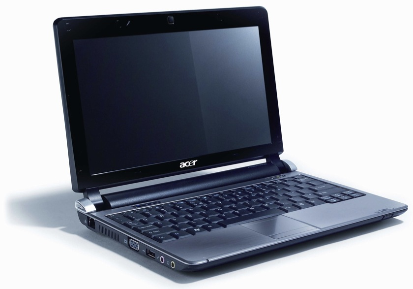
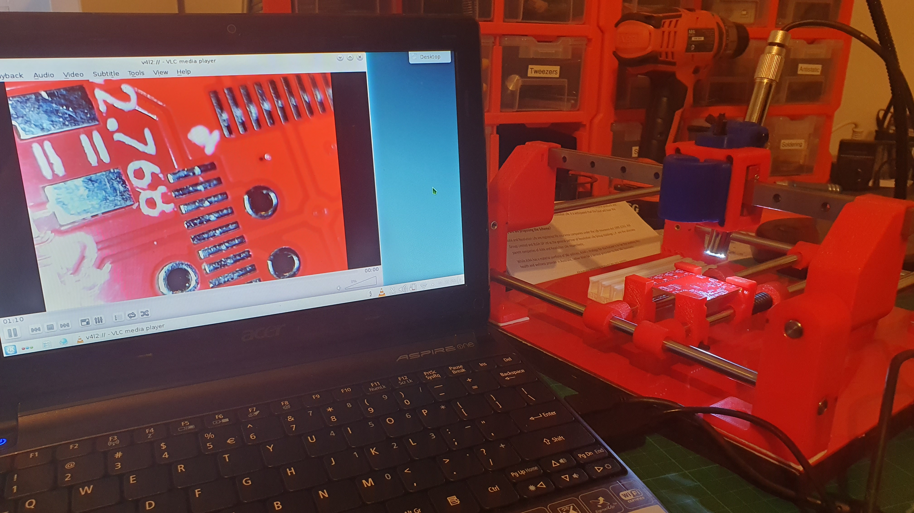

So, I dug out my antique Acer Aspire One. It has a maxed out Debian 8 running on it. A brand spanking new battery, thanks to the after market.

So, with a USB "snake" camera, for the manual PnP, I have a portable view finder for the manual PnPs.

I was a little worried how I was going to get the USB "snake" camera going.

Turns out, luckily, I have VNC Media Player running on the Acer Aspire One.

A little fidgeting and setting the "Capture Device" to the USB "Snake" and, voila!

