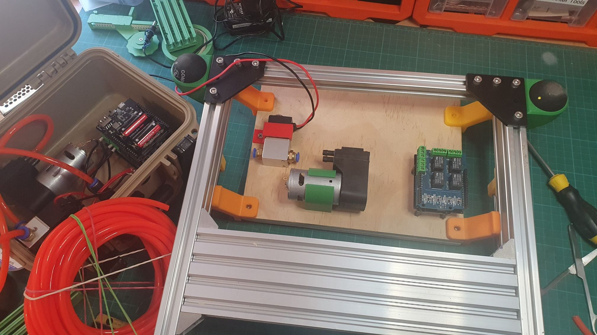

So, I am fitting a remote wifi vacuum setup under the arm wrest of the larger manual PnP machine, based on the portable vacuum setup, in the small [Tactix Tough Case](https://www.bunnings.com.au/tactix-tough-case-in-tan-small_p0331392?store=5160&gad_source=1&gclid=CjwKCAjwjsi4BhB5EiwAFAL0YCinuV9O-u_A5PPC6y9AF01Pdno9XYcg3xKJjHPlPQT20bupPLnYtBoC57wQAvD_BwE&gclsrc=aw.ds&productName=applinks&pid=0331392) on the left.

I had designed a bracket for the solenoid ([in red](https://www.thingiverse.com/thing:6756674)) and one for the [12V vacuum pump](https://core-electronics.com.au/vacuum-pump-12v.html) ([in green](https://www.thingiverse.com/thing:6756742)). You just screw them down with wood screws into the back of the board. You might notice (also in green) the "feet" for the manual PnP machine, being [squash ball holders a la a Prusa Bear mod option](https://www.printables.com/model/20292-low-profile-v-slot-squash-ball-feet-prusa-bear-log/files?lang=es).

What yer cannah pick up is the input for the vacuum pump, the lower of the two ports, has a larger diameter than the out diameter of the 6mm hose.

I had forgotten that I had 3D printed a small adapter, that I glued into the input port.
