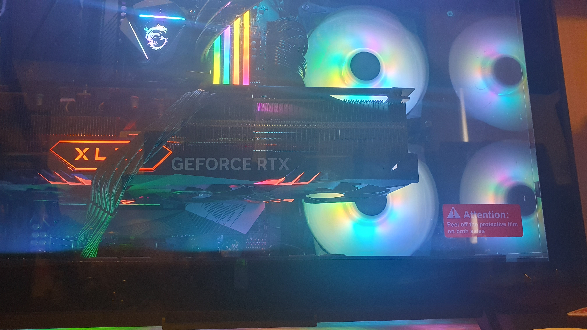
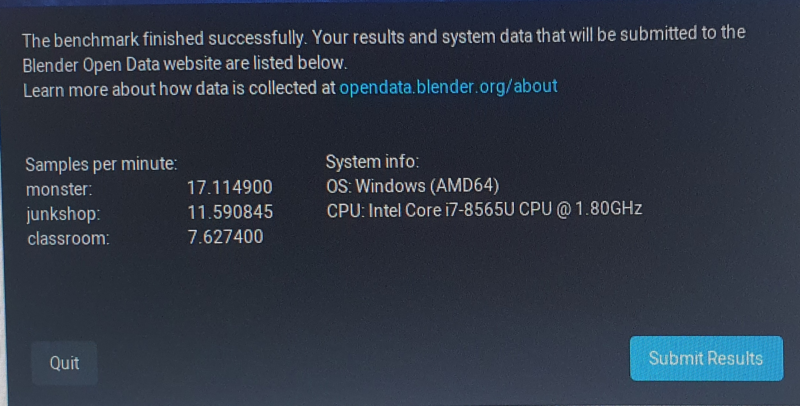
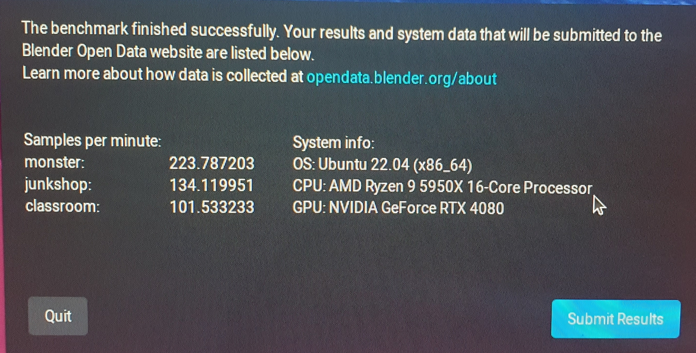
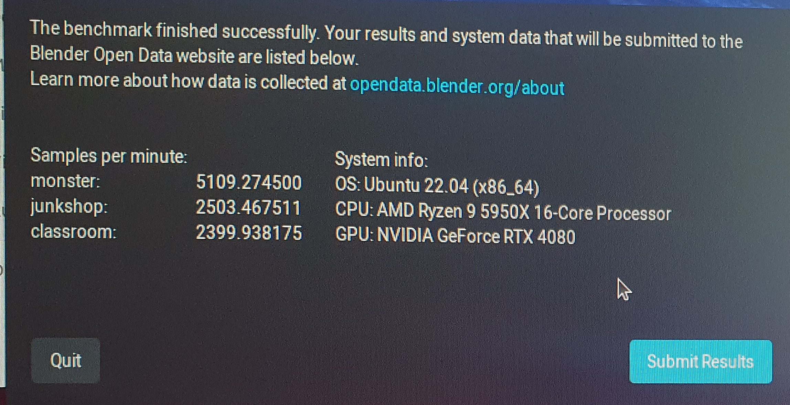

So, Debian install was a FAIL! I couldn't get the thing to get past:


```
NetworkManager-dispatcher.service
```


So, I had images in my head of somehow having fragged the mobo? Turn around time on Debian user forum slow (about 24 hours). I tried a few things suggested, jumping in at the grub startup either turning the GPU off or setting up a recovery mode. Neither worked.


So, while I am a Debian fan, I lowered myself to try a Ubuntu 22.04.3 LTS distro. So, guess what? The system came up a treat, and absolutely painless!


First things first, I installed [OpenRGB](https://openrgb.org/index.html) to get the LED dancing!


Nuasance factor around the "OpenRGB Effects Plugin" is that you cannot download from openrgb.org and have the stinking plugin work. You need to go first to the [github site](https://gitlab.com/OpenRGBDevelopers/OpenRGBEffectsPlugin), to find you also need install first:


```
libopenal 
```


Note, if you install the plugin B4 you have installed the dependency you'll not see the Effects tab turn up and have all sorts of strange emergent behaviours. Too many to bother discussing.


In the end, once you get the thing sorted you get a range of effects, and now we've dancing LED!


[](./20231126_122556.jpg)

Dozens of optional effects, though its a pain trying to test them out. You often need reset the program and often need fiddle to turn off an effect.


But then, the blender benchmark thingy. I essentially get a order of magnitude improvement laptop to MonstaPC running on CPU then Monsta PC running on GPU!


[](./20231126_134404.jpg)

Yeah old HP Spectre x360


[](./20231126_130740.jpg)

New MonstaPC running benchmark on 16 core CPU


[](./20231126_131127.jpg)

New MonstaPC running benchmark on RTX 4080


Although, the benchmarks for the MonstaPC are not up there with the same elements as posted. Needs looking into.


And yet, ...


[](./mine.png)


https://www.youtube.com/watch?v=OKSWVGg2rmM
