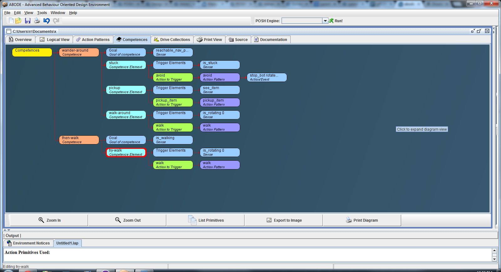
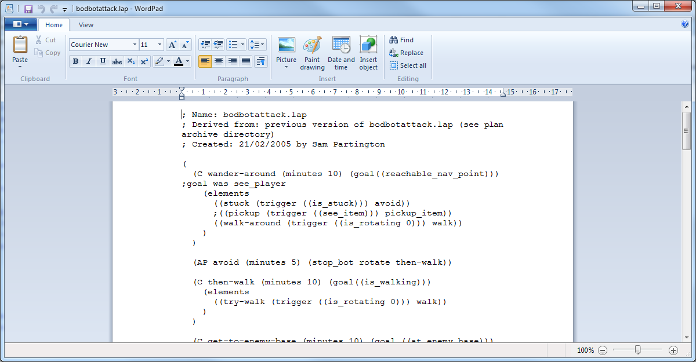
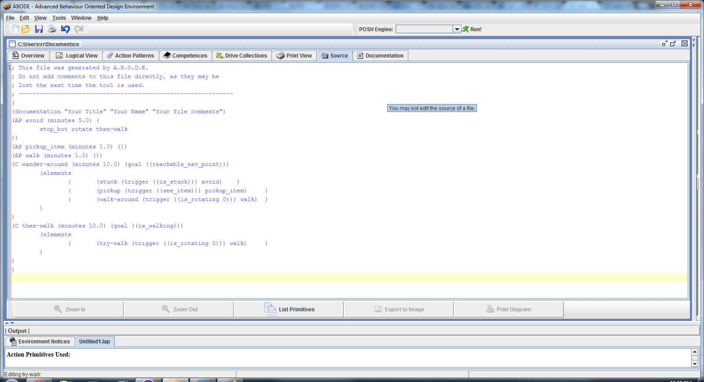
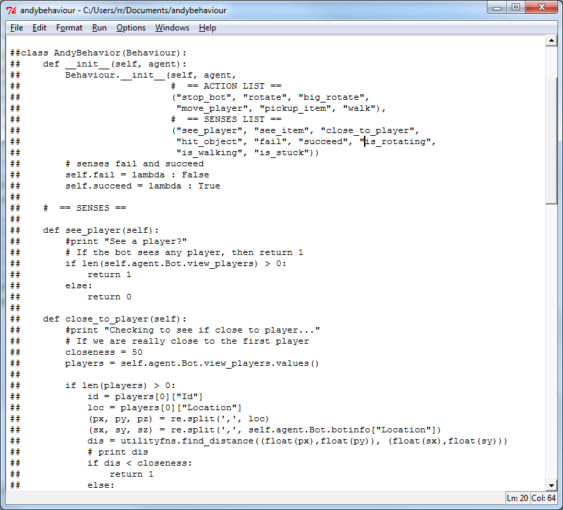

... it pays to dream.
I mentioned the idea of using [petri-net based plans](http://organicmonkeymotion.wordpress.com/2013/08/06/well-that-about-wraps-it-up-for-ros/ "Well that about wraps it up for ROS …") as part of mission planning for my vehicles previously.  The idea was based on papers on ways AUV were controlled.  I found a python based petri-net library but there appeared to be some effort to sort out a graphical editor.
I lucked into find on Behavior Oriented Development and an idea called [POSH](http://www.cs.bath.ac.uk/~jjb/web/posh.html "Very POSH") which takes a plan in lisp like language.  I further lucked into a [python based POSH engine](http://www.cs.bath.ac.uk/~jjb/web/pyposh.html "PY POSH").  Moreover I found a POSH editor, though it didn't reverse engineer POSH files into their graphical representation, but it did help me start to understand the syntax.

The image above is my reverse engineering of one of the examples from the jyPOSH distribution, namely:

Which becomes (in the source file window of ABODE):

Any way, the gist is you draft the plan in POSH and then code a plan agent in python that executes the plan, thus:

ACTIONS and SENSES are just methods on the Behaviour class.  This makes sense to me (also have played with LISP - including writing LISP-like extensions to FORTH) so I am going to work on this in the background and see about how this might be integrated into SPADE agents - even if it is just a plan execution service.

So, in short  it requires a modular behavior library in any OO language, and a version of [POSH action selection](http://www.cs.bath.ac.uk/~jjb/web/posh.html) for that language (aka jyPosh).

Clearly the SENSES and the ACTIONS can talk to a robotic vehicle.

It may even make sense to make this the vehicle AGENT and use it for the reactive planning and then use the SPADE agents as higher level agents.

One of the "SENSES" could be receipt of commands from a port - for example.  A couple of the examples do this so no reason why this could not be to a XMPP chatter server say AUML centric as used in SPADE.  Could also be ZeroMQ or ZeroRPC as well.

All good. Options are good.
