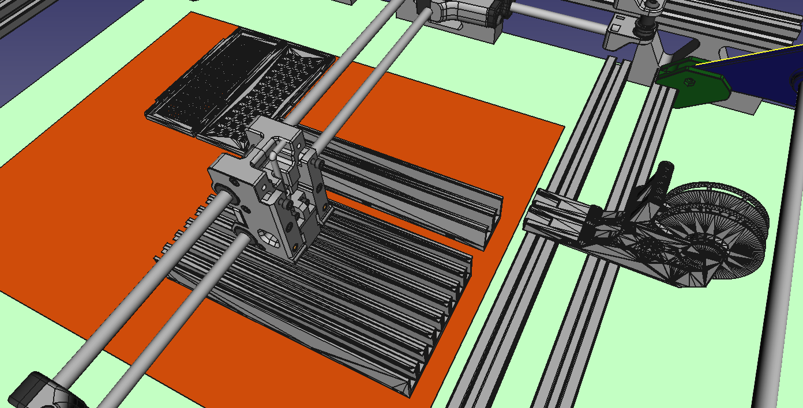
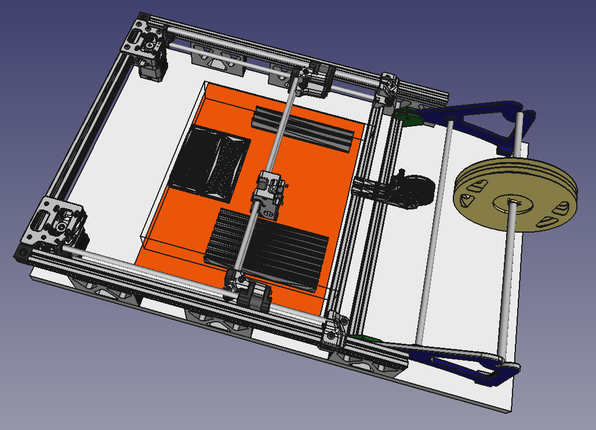
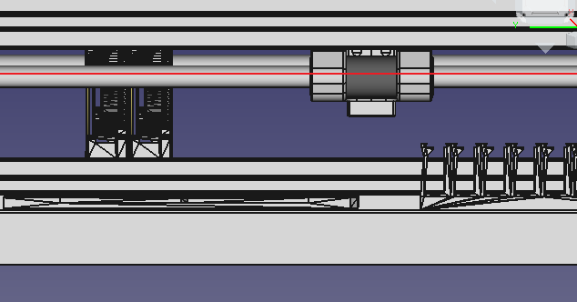

To avoid too much fiddling I am opting for a 300x380x1mm steel sheet for the working area per Figure 1 (see red area). Now this is a nice trade off as the actual working area is 310x310 but the cost of sheet and guillotining bumps the price up somewhat.

Figure 1

The [strip feeders on the work area are parametric](https://www.thingiverse.com/thing:2506053) (lower middle). They are ideal because you can have as many or few rows, change the length and also (importantly) the height.

A [minitray](https://www.compuphase.com/electronics/minitray.htm) idea seems good too (top left). It is good to have options. They have magnets embedded to hold them down. The original uses 2x4mm cylindrical but I up'd it to 3x4mm cylindrical, since 2x4mm cylindrical are harder to find it seems.

And, of course, the [push-pull feeder](https://makr.zone/new-all-3d-printed-tapereel-feeder/399/) on the rails (middle right).

Rearranging now, with a 310x310x50mm working area, I found rotating the metal bed more appropriate (see Figure 2).

Figure 2

Although, now I seem to have worked out that I need raise the gantry level some, see Figure 3 (note the red line denoting 50mm above the metal plate. So I need to redesign my stanchions to lift the gantry up further.

Figure 3

I need also to think this through a little more, if I want the pushpull feeder incremented by the gantry.
