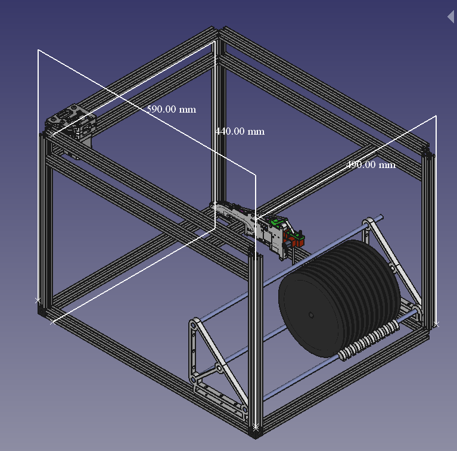
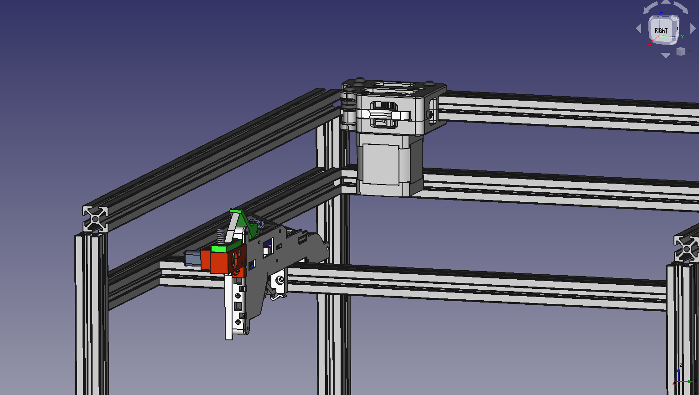
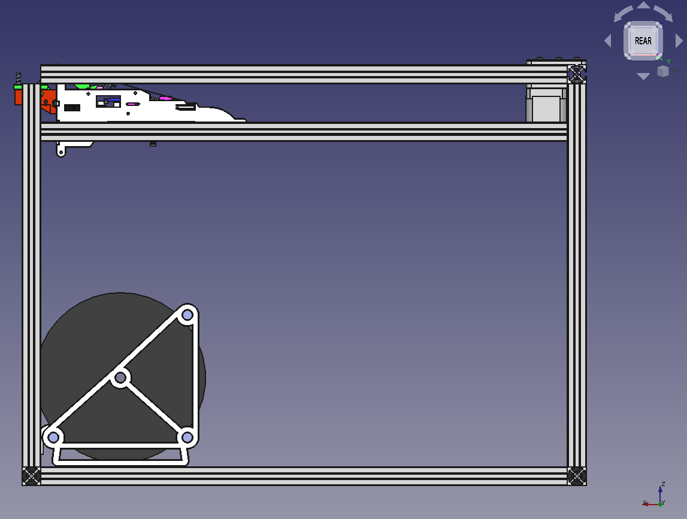
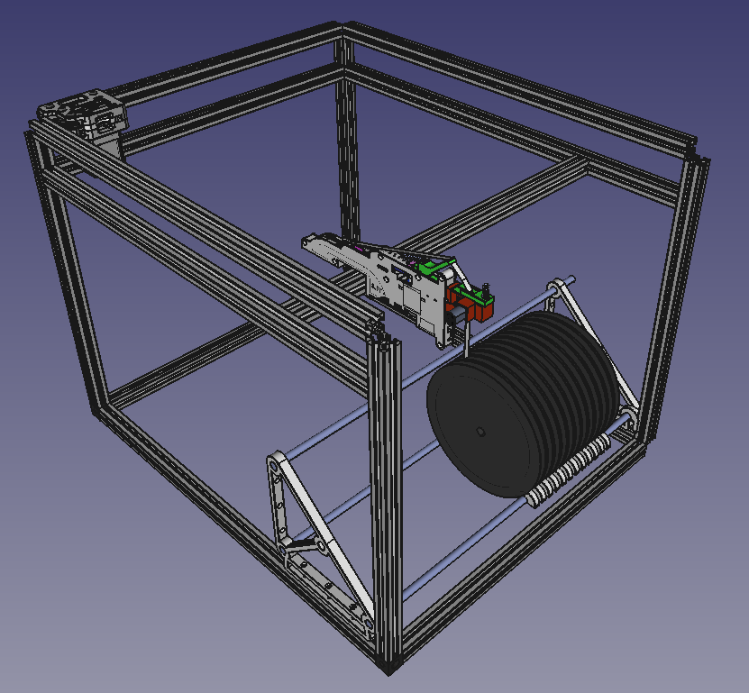

Figure 1

So, Figure 1 is the updated design for my corexy PnP. I am going for a 310x310 working range (not 400), as I am only building a smaller system.

So, now the chore of moving all the parts over, Figure 2 is B Drive Motor Assembly brought across. More to come.

Figure 2

Per Figure 3, just a tad overhang of the feeder BUT not bad, since we're using standard lengths of extrusion.

Figure 3

Obviously, I could make it shorter. Or build a layer in the middle, perhaps storage drawers? Still thinking that through.

What? Sure, the obligatory perspective shot is at Figure 4.

Figure 4
