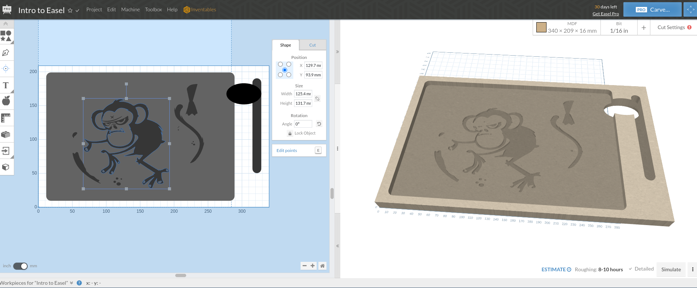

Just dabbling with a milled wooden holder for me [Watcom ONE medium that I grabbed from JB HiFi](https://www.jbhifi.com.au/products/wacom-one-by-wacom-medium).

They're using [Easle](https://easel.inventables.com/) at the maker space, so something like that at Figure 1.

Figure 1

I still need to get this tuned at the maker space, as you need the paid version to add bits etc.
