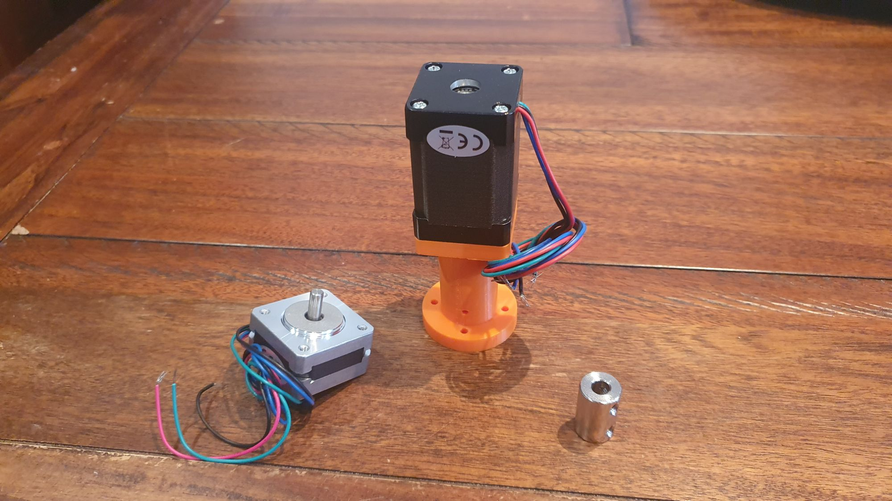
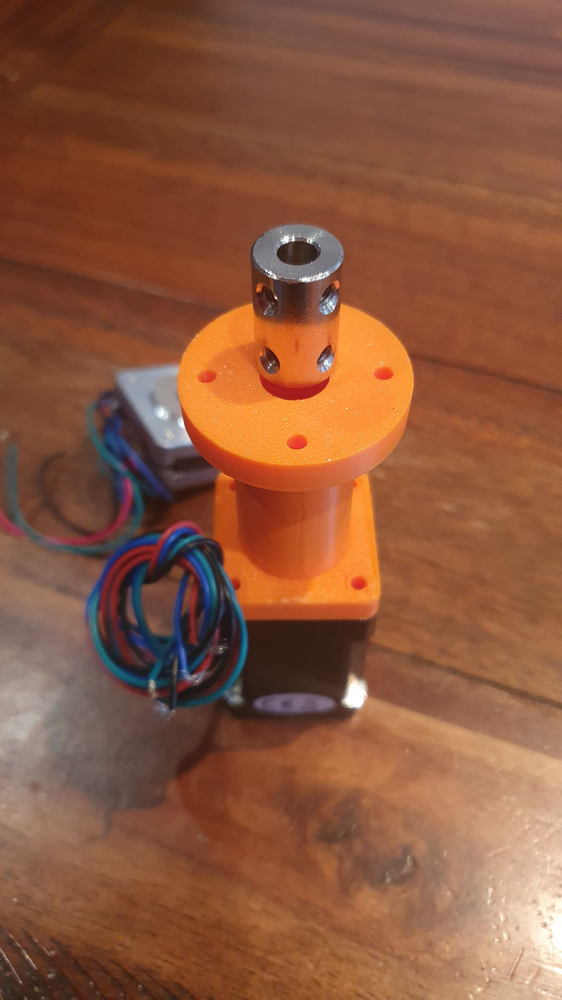
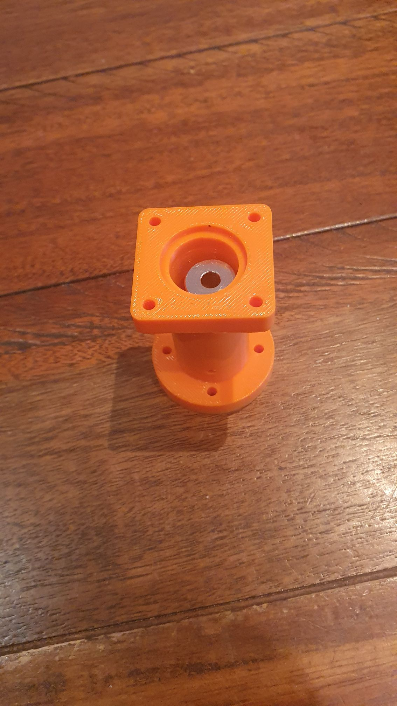
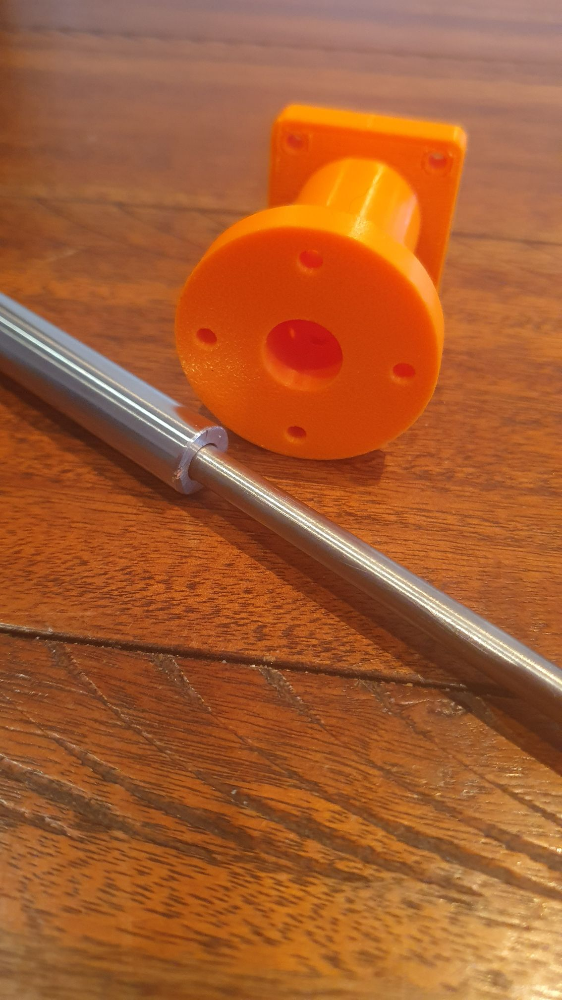
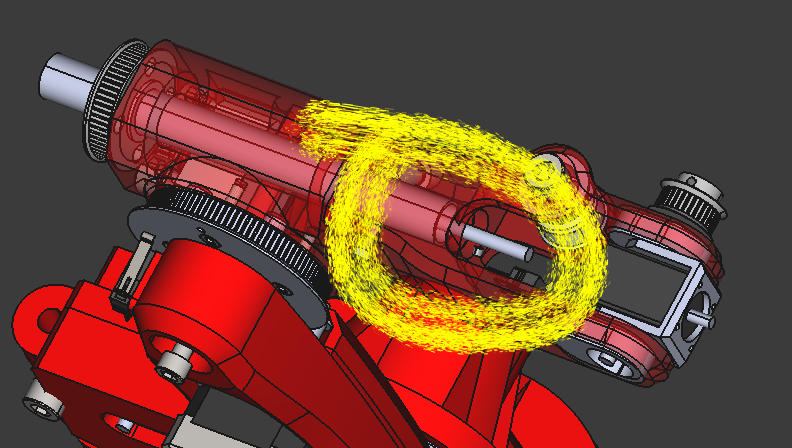
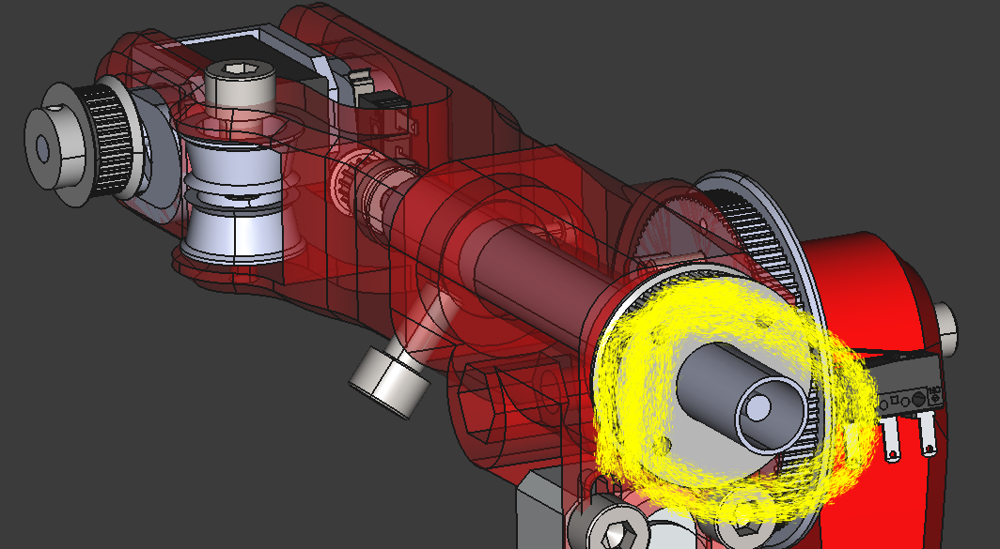
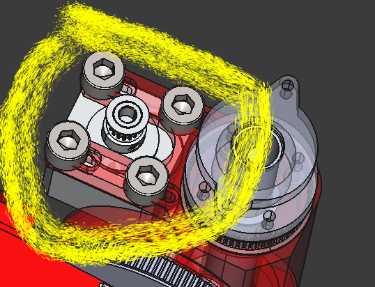

So the NEMA 11 x48 arrived (the one sitting on the new adaptor). More power to rotate the forearm with effectors.

The NEMA 11 x20 is needed for driving the elbow. I'm going with that at the moment as that's in the borrowed design, and the power is amplified by a toothed gear so I'll assume it will suffice (for now, so as to reduce an onslaught of redesigned components).

I'll have to redesign the adapter any'old'how, since I duffed the size of the hole to take the adaptive connector for the rod that rotates the wrist.

Just kidding! That is sorted, though the diameter of the other end will need be shunted up a tad, since it's supposed to be a snug fit on the 12x6 (ODxID) hollow machined rod.

The adaptor will go over the 12ODx6ID shaft and the NEMA 11 x48'll drive the 6mm shaft.

For context, circled in yellow is what would be the 6mm shaft, poking outta what will be a 12ODx6ID hollow shaft.

Heres the puny NEMA 11 x20 with its associated pulley.

