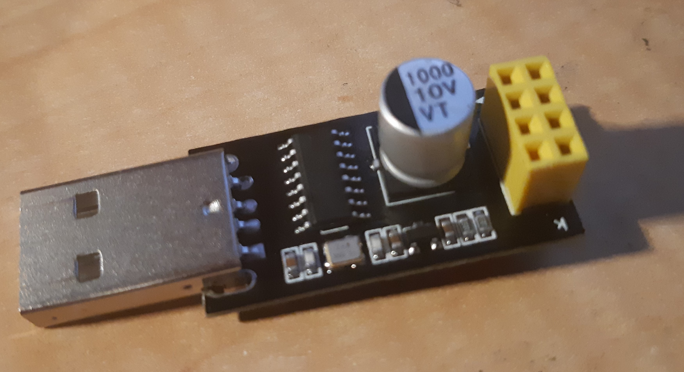
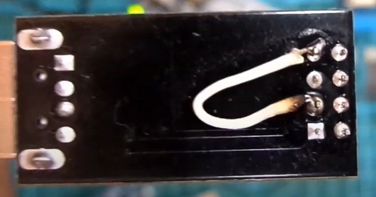
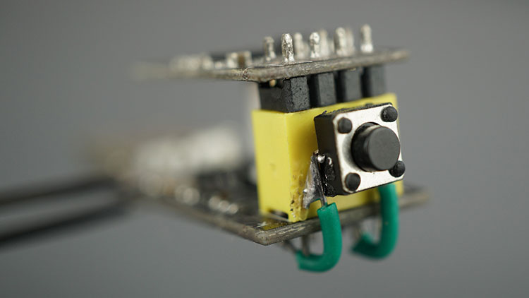
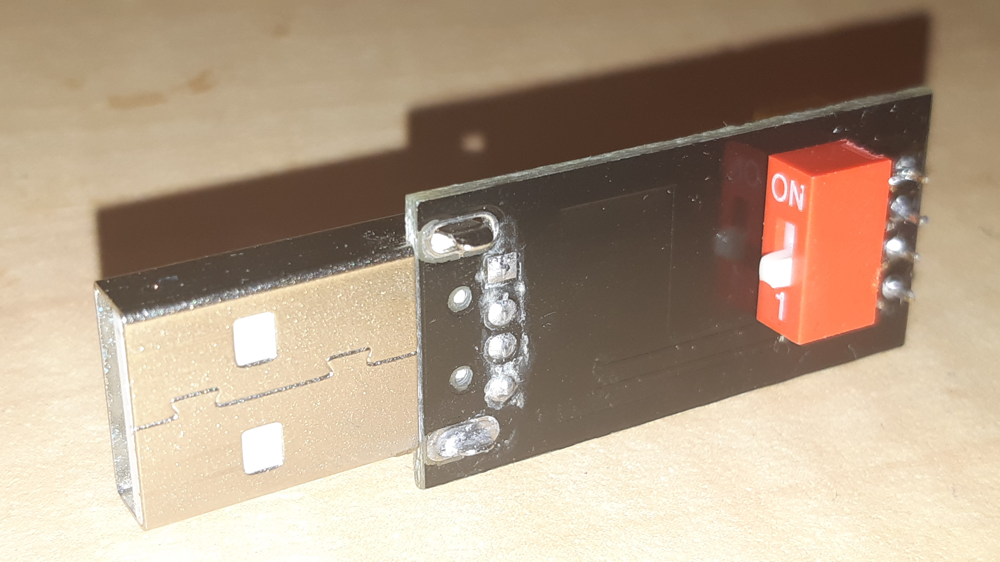

So, if you were slow like me and did not buy an ESP-01 programmer with a switch, to switch in and out of programming mode, there are a raft of options to fix that.

One option is just solder on a wire thus:

Another is a push button and a couple of wires, with the button glued to the end thus:

I opted to by a box of dip switches of various sizes, to have handy, and simply used a SPST dipswitch thus:

Much neater and more straight forward a hack.
