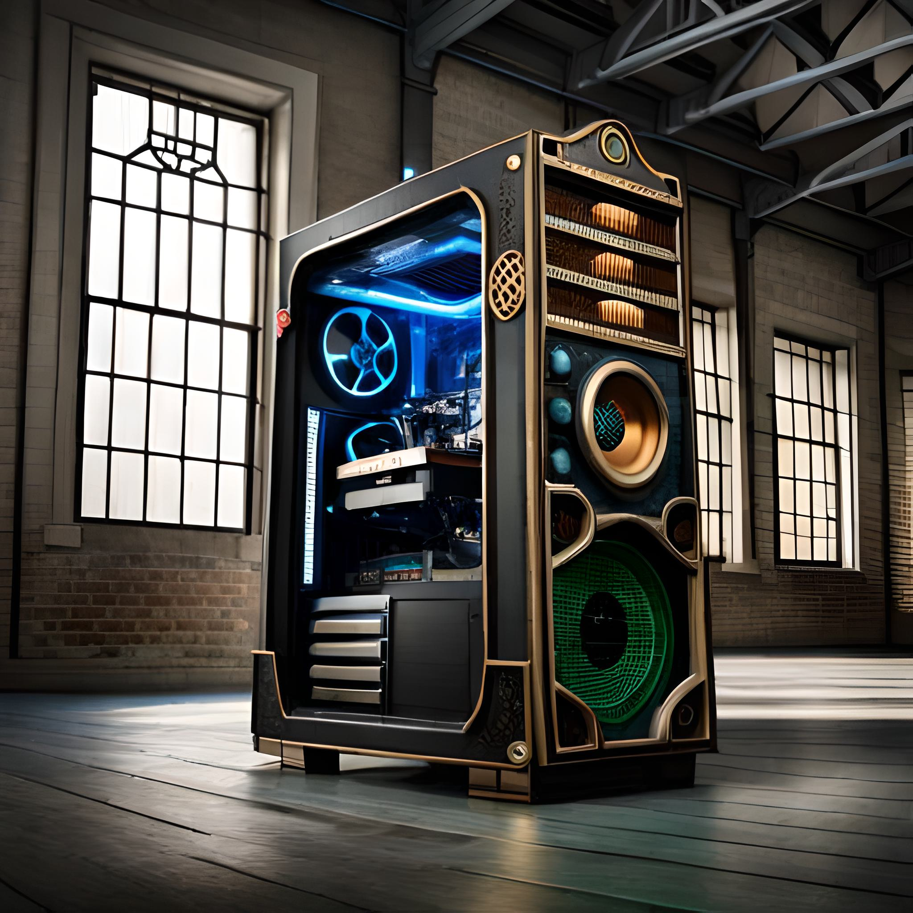

So, finally, all the parts are here, so the build will comprise of:

* AMD Ryzen 9 5950X 16-Core AM4 3.40 GHz Unlocked CPU Processor
* Gigabyte X570S AORUS PRO AX AM4 ATX Motherboard - Rev 1.1
* NY GeForce RTX 4080 XLR8 Gaming VERTO EPIC-X RGB OC 16GB Video Card
* 4 sticks of Corsair Vengeance RGB PRO 32GB DDR4 3200MHz Memory
* MSI MAG CORELIQUID 280R Liquid CPU Cooler
* 6x Thermaltake Pure 12 120mm ARGB TT Premium Fans
* 2TB SDD, Samsung 970 EVO Plus 2TB NVMe 1.3 M.2 (2280) 3-Bit V-NAND SSD
* Corsair RM850x 2021 850W 80 Plus Gold Fully Modular ATX Power Supply
* Lian Li PC-O11 Dynamic Tempered Glass Mini Tower Case - Black

NICE!

https://www.youtube.com/watch?v=8EGyiMz0S4w
