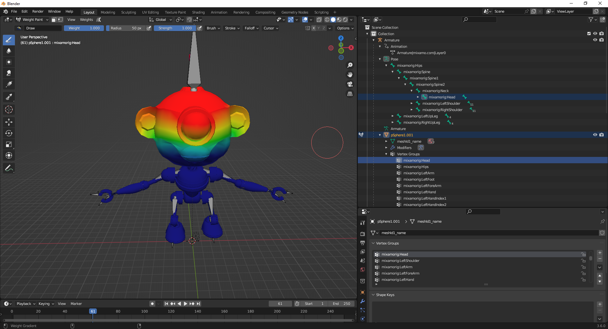
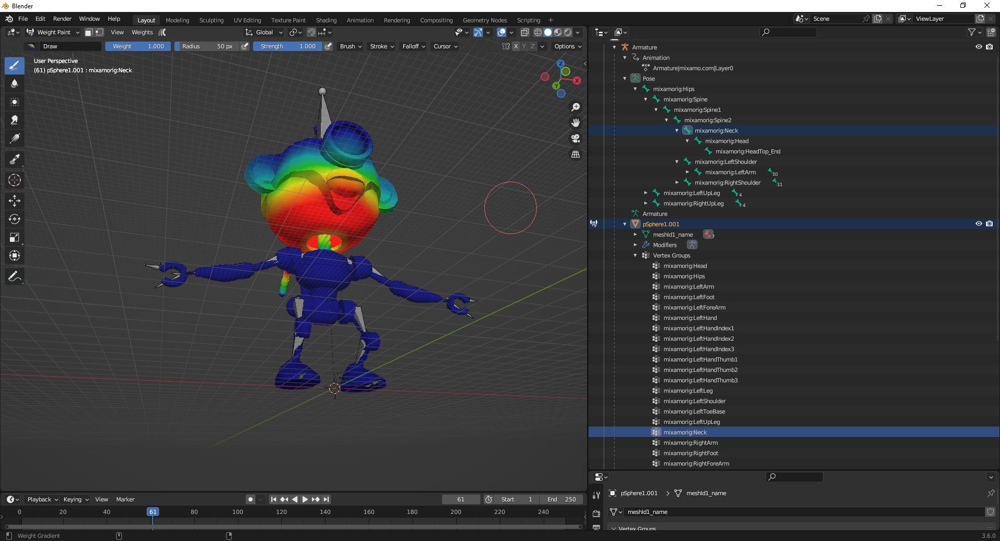
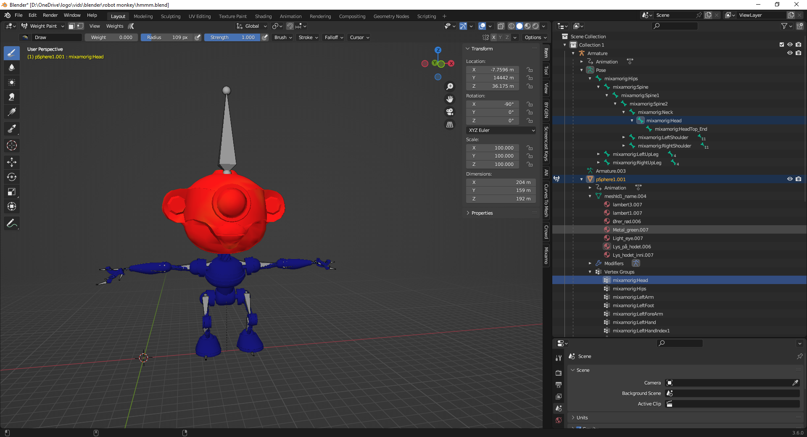

I have been SO LAZY!

I need sort my workshop/laboratory(mwahahaha)/Office to get it tidy and then I can comfortably sit down for another sprint on the [Prusa Bear clone build](https://organicmonkeymotion.wordpress.com/category/bear-build/).

So, I did what I would normally do, ...

..., I procrastinated.

To mark that occasion, I did make a new animation.

Wanna see?

https://www.youtube.com/watch?v=BJGeUDsSLr8

Based upon me new character.

https://www.youtube.com/watch?v=EErmvvI7wJQ

So, I worked through a problem I've seen with this character as well as the other so far unnamed monkey.

Sloppy head.

When you suck these non-human characters up into Mixamo or actorcore, you occasionally will get sloppy head.

The other so far unnamed monkey got sloppy head, for sure, at actorcore, but not at Mixamo.

Rusty got it at Mixamo.

So, can't help it, you have to go into the "weight paint" mode and adjust the bone influences. I had to watch out for the neck especially, as it contorted the bottom of the head. The contortion was worse when there was gross rotation of the head and neck.

Head vertex group

Neck vertex group

Amended

https://www.youtube.com/watch?v=ssmUAm4SAIs
