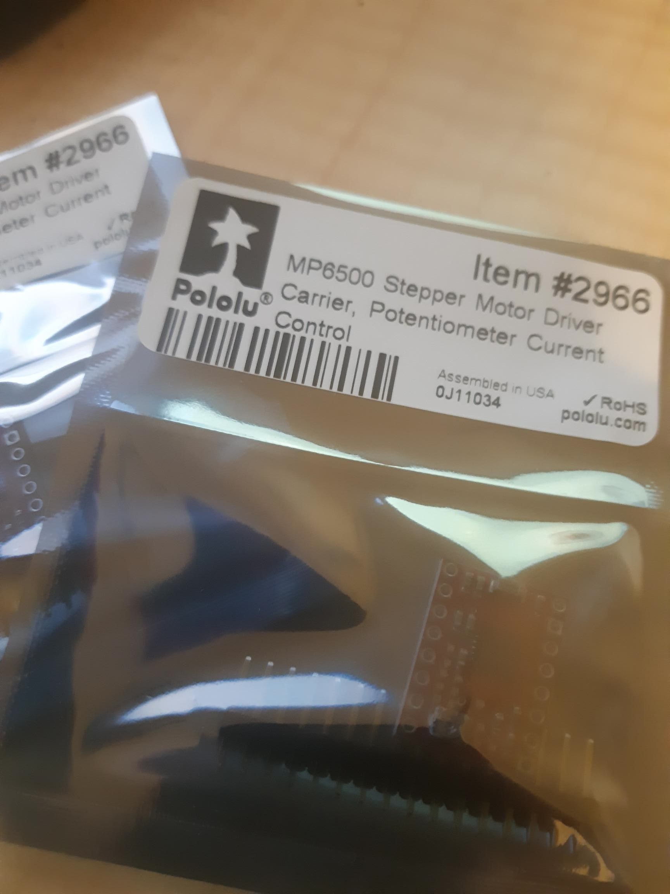
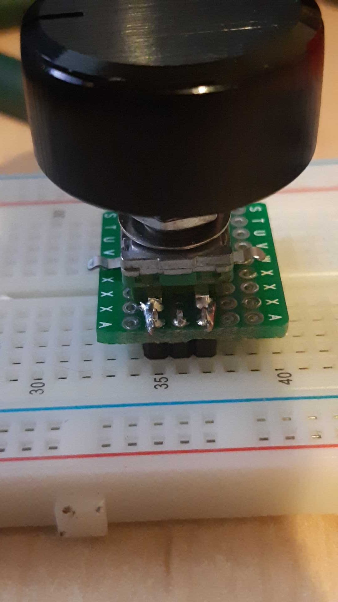

So my MP6500 have arrived from LBE. [Potentiometer variant](https://www.pololu.com/product/2967/resources). That does create delicious pressure to keep hacking on the xygantry for my [USB microscope](https://organicmonkeymotion.wordpress.com/2021/04/16/xy-micro-platter-for-usb-microsope/).

So, poking around for code for the MP6500 I hit what I suspected, since there is much more press around other drivers, specific code for the MP6500 is scarce.

The best library seems to be [StepperDriver](https://github.com/laurb9/StepperDriver) as it at least has a couple of "general" objects to control motors with DIR and STEP pins. Seems to compile fine for Wemos D1 Mini. So fine for Arduino IDE, for the hacking at least. The library has examples for other stepper drivers, which is mostly in and around the programming of micro step inputs. So, with some work an MP6500 class could be crafted. At the mo, however, the micro-stepping options will be hard wired, because we'll not have enough pins available to drive the micro-stepping pins.

Things are starting to come together then for the prototyping phase, including hacking up a breakout (sans resistors) for the SR1230.

Don't get judgey on the soldering, if you had my eyes you would struggle too. I probably need another prescription for really REALLY close work.
