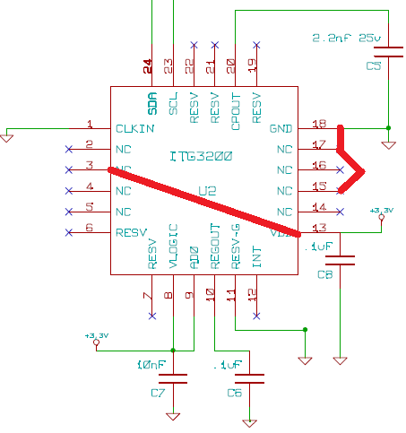
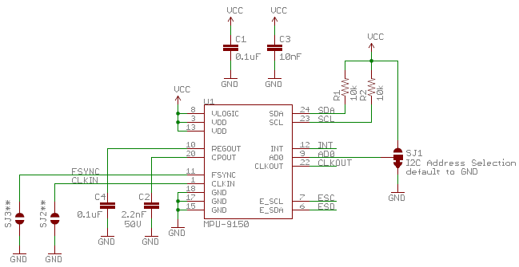

Apart from a couple of unconnected pins on the PhuBar3, the requisite caps and grounded pins seem to be already sorted - but there will be some fine soldering.
[PhuBar3 Schematic](./itg-3200-wiring1.png)[MPU-9150 Breakout Schematic](./mpu-9150-wiring.png)
