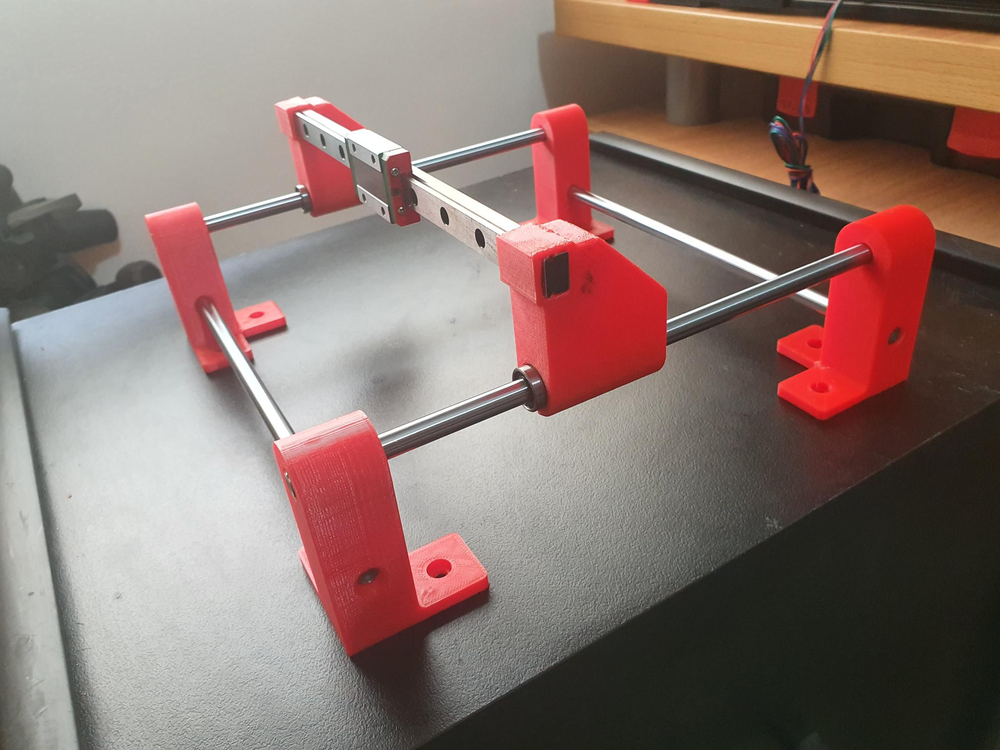
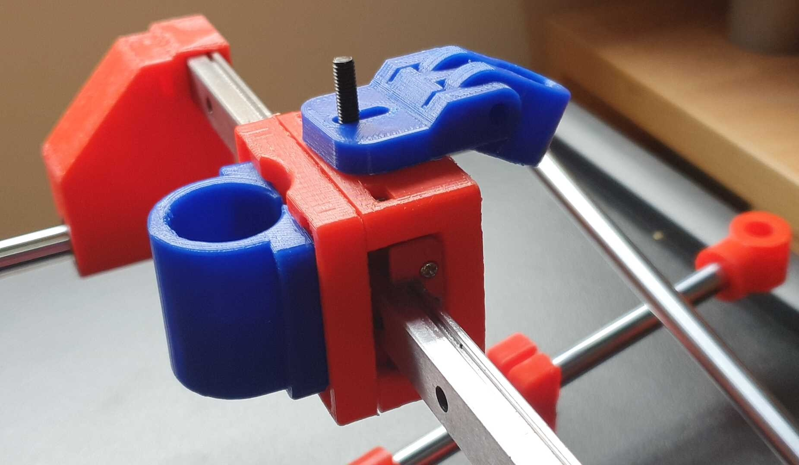
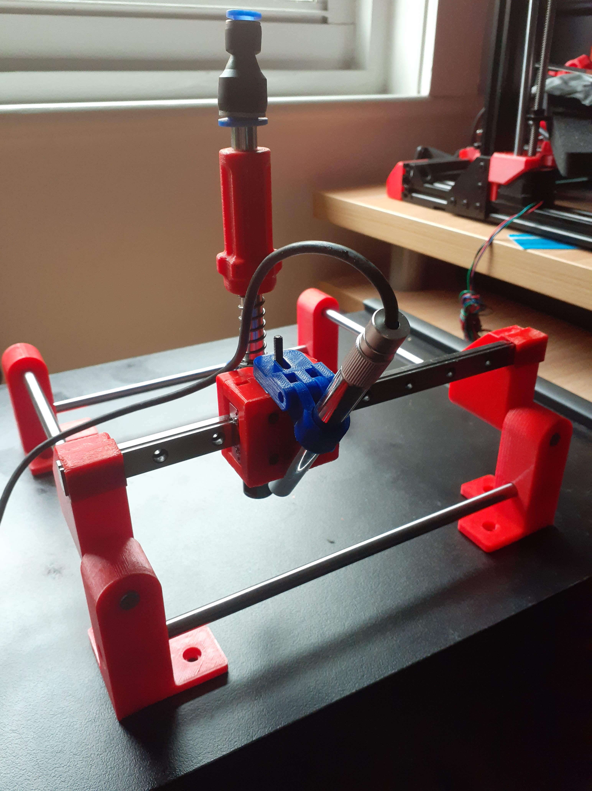

... and thus a smaller manual PnP machine for smaller, quick jobs. Will use x-gantry from [here](https://www.thingiverse.com/thing:3644398). Note I remodelled the gantry supports to press fit the linear bar as the original design was not happily allowing a neat mount of the rail – I had to relent and epoxy it on the larger manual PnP I built.

The cylindrical rail needs to be tighter, but I'll just add a touch of thread lock, though once the stands are screwed down to a wooden base. I'll hang a board holder off the lower rails.

I am building a vacuum kit that is portable and can be used on either this small manual PnP or the larger manual PnP. The PnP head connects by magnets, so easily swaps between the two. Especially, since the x-carriage is the same on both.

