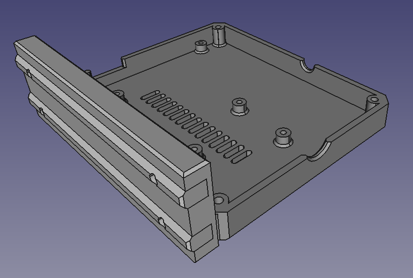
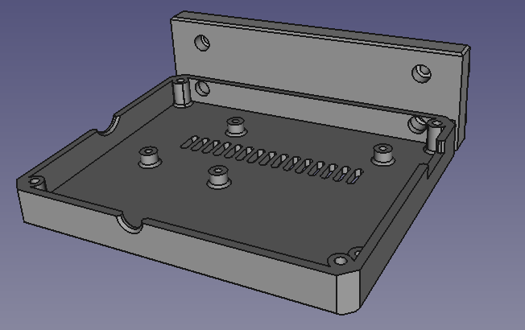
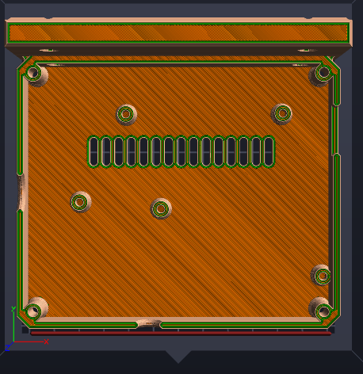

Decided [this was the case for my Bear's mobo](https://www.printables.com/model/64977-vertical-case-skr-mini-e3/files).

However, I have modified, see below.

More solid foundation for back of 4040 of Bear's frame.

Holes plenty deep to keep bolt heads out of the way.

The print is running now. Pretty hairy, its probably the biggest base I can squeeze onto the Finder. No room for walls or brims.

So SQUEEZY!
