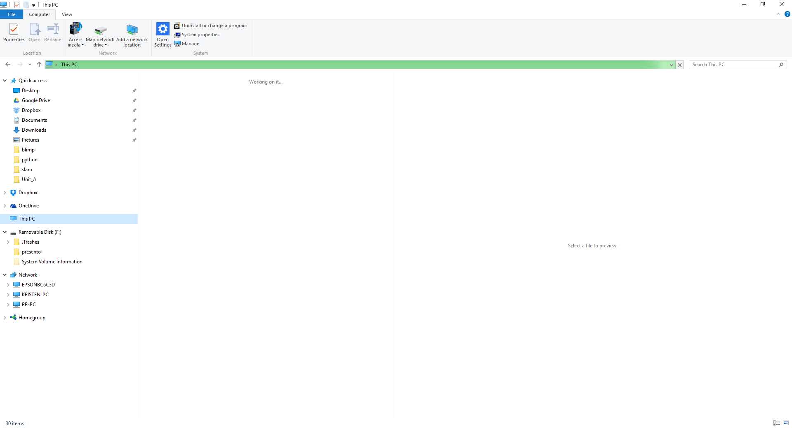

Why on earth does Windoze 10 Explorer need to scan my "This PC" for 15 or more minutes to find my drives and files.  Computer is dead useless with Windoze 10 with all the fracking problems.
Lost WiFi with last update.  Seems a pandemic according to my crawl of the Net.
Now the fix is to apparently update drivers.  Go figure, Acer is not updating drivers for my machine to work with Windoze 10.  Ralink (now MediaTek) driver installer is blocked by Windoze 10.
So the workaround was to use the wireless extender, that I connect my embedded development kits into, and an ethernet cable into back of my PC to bypass the need for the internal WiFi card.  Not optimum but otherwise how else do you fix it?
Especially the dearth of trustworthy help on the Net.
So many various fixes offered with trails of failure recorded.
Microsoft help offered was that I download a driver.  Very Dilbert-like of course, download a driver when one cannot connect to the Net.
Yes, various other routes to get around the lack of download but odd lack of critical thinking from goobers on the user groups.
OH FRACK OFF!

So now all of my system is "missing" from Explorer!
Something quite chronic is happening to this stupid Windoze 10 box.
It is so depressing this rubbish, the trawling on the Net, the pasty albino gimps waiting on the user groups to slobber over your helplessness.  And no one really with a reason for why this crap happens.  Except Microsoft trying to improve your user experience.
Can't complain really, after all got me my Windoze 10 update for free.
