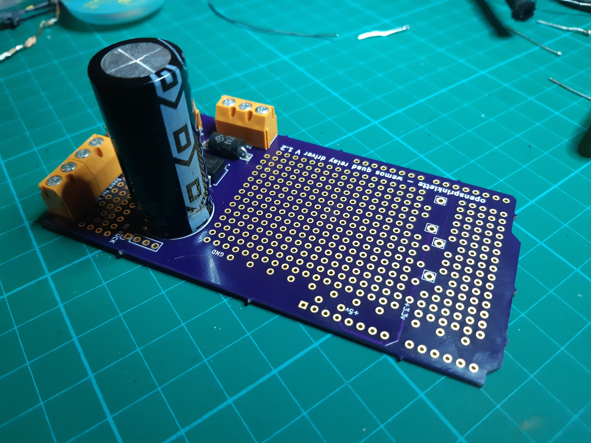
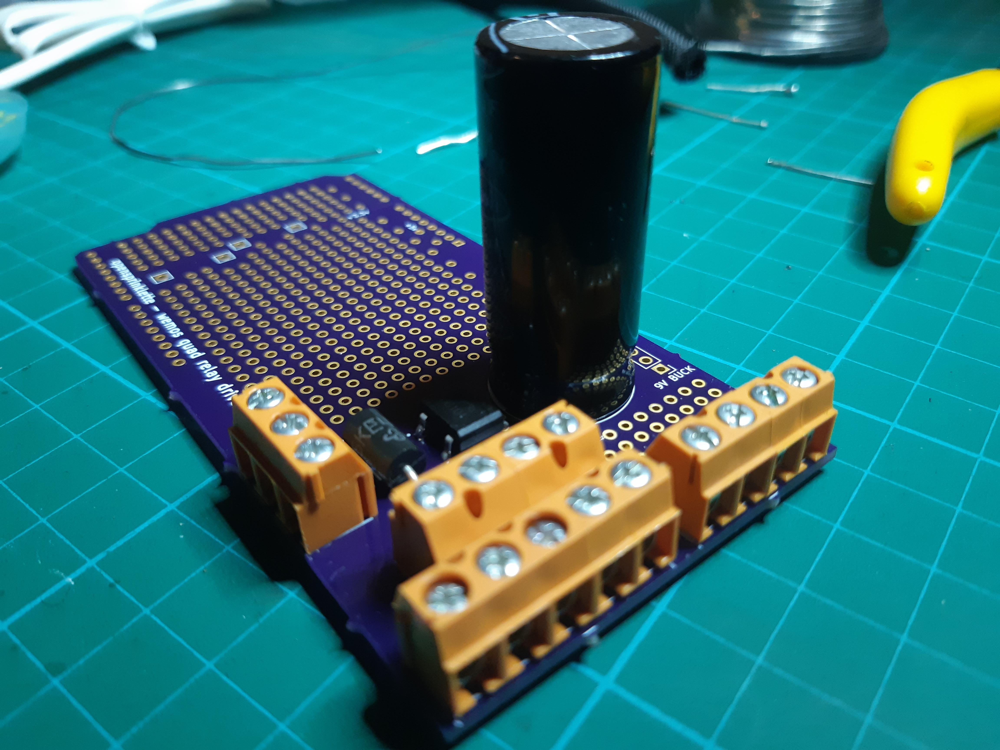

So, I have set up the quad board to be able to wire the relays up and be a little tidier.

The 24VAC comes in the side via two of the three posts. The third post passes up the 24VAC to the commons of all of the relays on the relay board. The four N/O outs of the relays go to the inward 4 posts. They then neatly exit on the 5 posts on the end along with a common. The additional 4 posts on the end are for inputs/outputs, not currently assigned. The breadboarding was added to allow for hardware hacking (including the small matrix near the input posts or are they output posts? Up to you).
