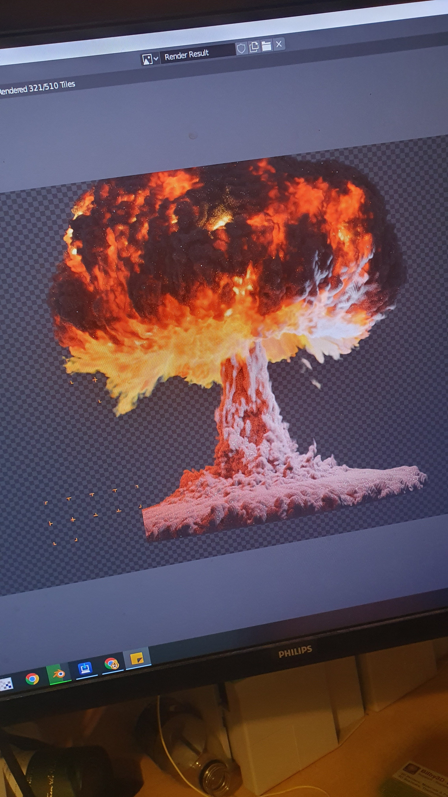
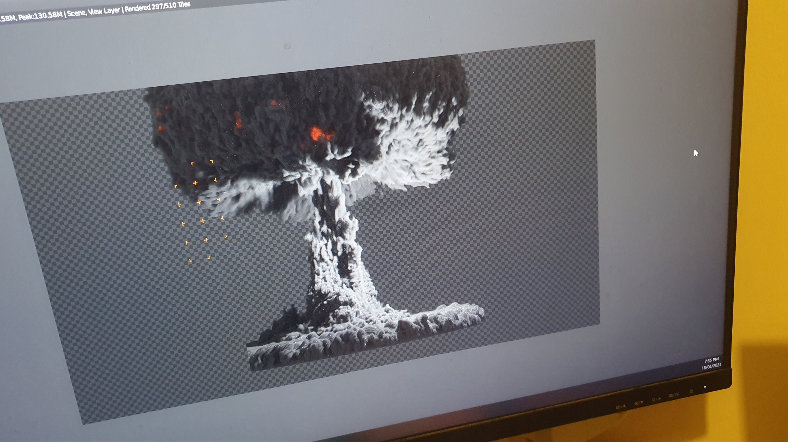

You might have noticed, at the end on my vids, nowadays just before my animated end cards, I had either firey ball or a red hot cube? Just to punctuate the end? Bought off the web? I am now working up my own animated firey end scene.

I am still waiting on the final parts for my RTX4080 based PC. So, the poor old HP Spectre x360 is taking (or will take) 2 days to render this draft using "cycles".

It will be complete with a preceding falling A-Bomb, with Monkey riding it.

I know. Kooky right?!

Animated atomic [explosion is from a tutorial](https://www.youtube.com/watch?v=2aX9yKTzN9Y). You can do it too!

I'll transfer this to my new grunter box soon. It'll be interesting to see if my purchase was worth it.

**UPDATE**

Okay. So I over estimated my laptop's grunt. Yes, it felt like it would be 2 days.

I just got home from work. So, 140/244 frames. A tad over 50%. So, I feel like saying 4 days?

Mind you. It's looking FRACKING FANTASTIGORICAL!

So yeah, I was worried the "fireball" wouldn't, and therefore would not be, "kool".

It FRACKIN does!

It FRACKIN is!

**UPDATE**

Okay, rendering will take 5 days.

**UPDATE**

https://www.youtube.com/watch?v=1VFEnujgUVE
