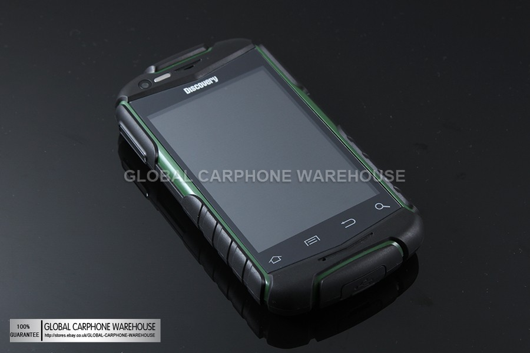
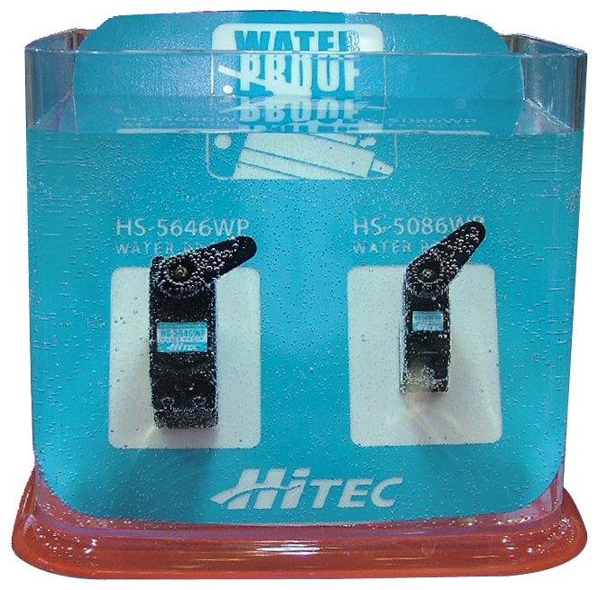
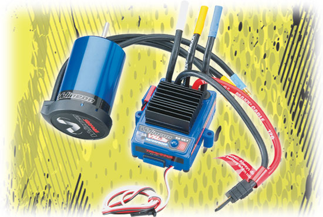

Waterproof mobile phones available between $70 single core and $140 dual core. [POSTSCRIPT Read later article](http://organicmonkeymotion.wordpress.com/2013/04/10/disappointing-but-go-figure/ "disappointing but go figure").

Android 2 odd on the single cores and Android 4 odd on the dual cores.
This will compliment the waterproof servos I have ordered for the Rock Crawler:

Or the waterproof [brushless motor and esc](http://www.towerhobbies.com/products/traxxas/trac3349.html "Go on, dunk it!"):

(\**pist*\* normal brushless motors can run under water BUT may need to do things to them to [make them last longer](http://openrov.com/profiles/blogs/waterproofing-off-the-shelf-brushless-motors "Fiddly but probably worth it."))
So a bluetooth module on one serial port of the:

And an XBee/Snap on the other serial port and viola, Perfect waterproof system ... well once I sort out how to waterproof the little board above.
Still, for projects that don't need the sensors and only want to drive servos or ESC then a bluetooth XBee module on the:

So many possibilities and you can mix and match without pesky wires.
