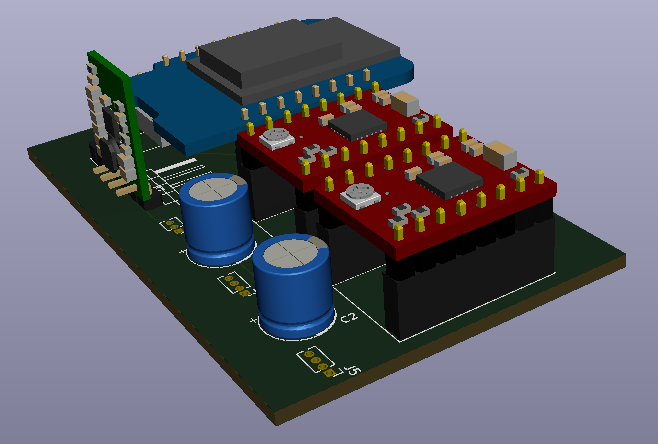
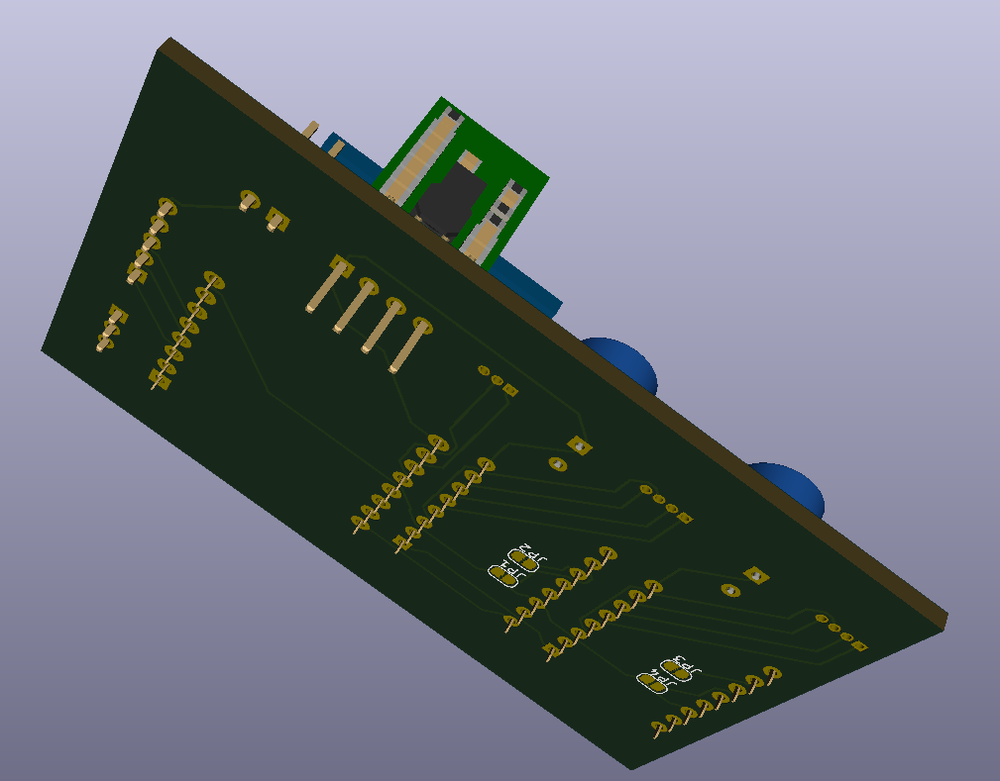
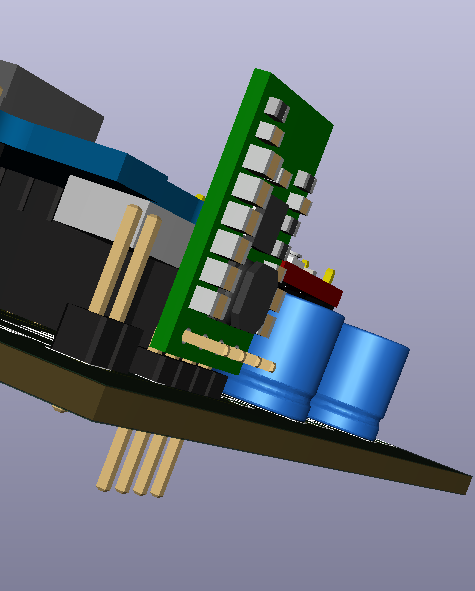
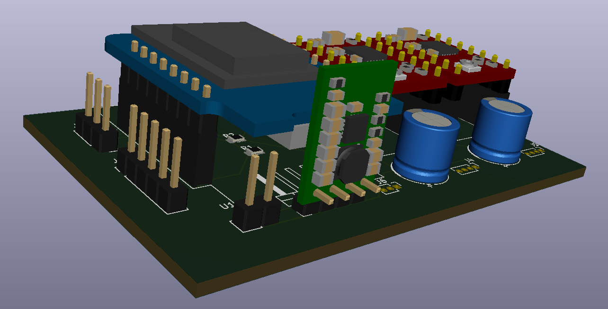
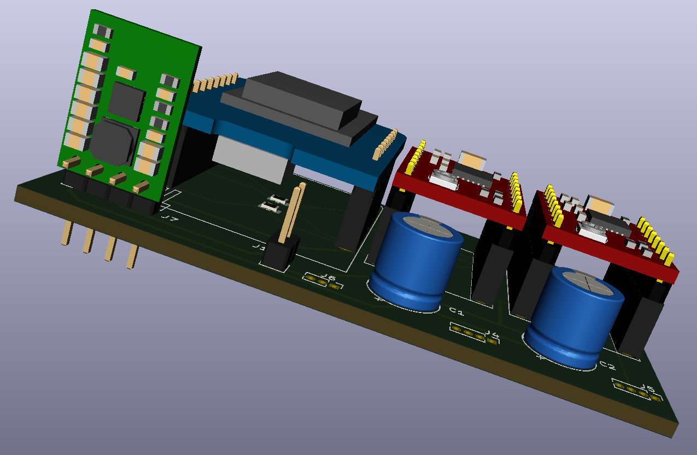
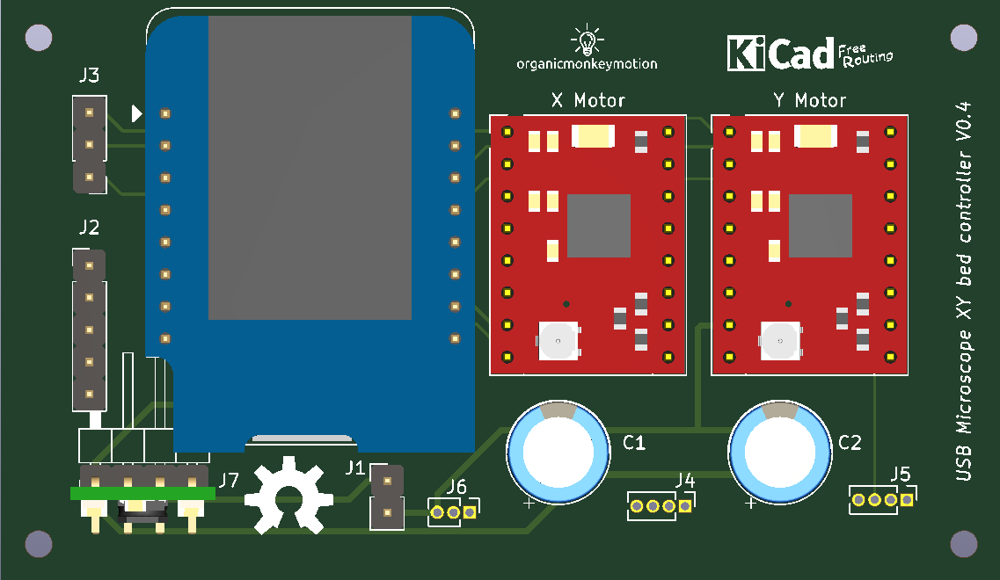
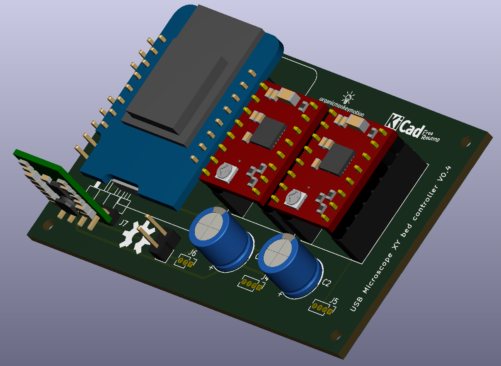

So, as I suspected, there is no schematic component for the MP6500 Pololu board. Not a problem as I have the drv8825 lib so I have just copied it as the MP6500 and made the minor mods required. The Pololu site includes the STEP file for the MP6500 module so all very VERY good.

Still some fiddling but here's V0.3:

So above we can see some changes. With the MP6500 there was the option of using dual dip switches for each motor driver to set the step size, but I opted for jumpers on the bottom. They come hard coded to finest step size and you cut tracks to drop back to full steps. I'll work out the best mode for the XY platter with the prototype setup.

The too-long pins jutting out are because I will literally be using a 4 pin header on a Pololu 5V up/down regulator and will need trim the pins.

I did grab the step file for the header to "snip" the pins, but rotten FreeCAD will import the step files but refuses to convert to a solid and so cannot "snip" pins and then export a variant. I will have to look into that, since I am still to look at design my own 3D models for importing into KiCAD - as an exercise. You can see more of the detail below.

I will be using the [2123](https://www.pololu.com/product/2123), which is the fixed 5volt unit. So you can pump between 2.7V to 11.8V to get 5V out. So, a standard 9V battery will be fine. These are the regulators I have been using on my openspriklette modules and work great.

* 

So much fun this board. I found I had an error in the schematic, that didn't jump out until I laid tracks (I had duplicated a couple of global labels but fixed that). I also rearranged some of the pinouts because of the physical board layout, to drastically reduced tracks complexity and use of vias is down to zero.

Just waiting now on MP6500s to turn up, to allow the prototyping to begin.

Yep, the regulator is in the way of the USB port on the D1 mini. I am in two minds here as I am probably not powering by the USB in any event. In any event, not sure it makes sense to program the D1 mini while inserted, because of the pins usage. I will mull over that fine detail for a time.

What was that?

You want to get to the USB port? Gawd you're bossy.

So, where we're at, while waiting on the prototyping work, is ta da! Call it V0.4.

Now, still TBD, is whether 2123 is apt for power conditioning on this when using the steppers. The size of the steppers probably fine (they are tiny). Not big on power circuits is me. The fun bit is I have a draw of the various 3.3V, 5V and 9V versions of this Pololu regulator thingy, but take care you don't take them out of their packaging - the freaking things are not marked so you can't easily tell them apart.
