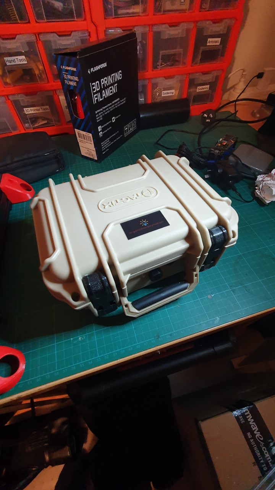
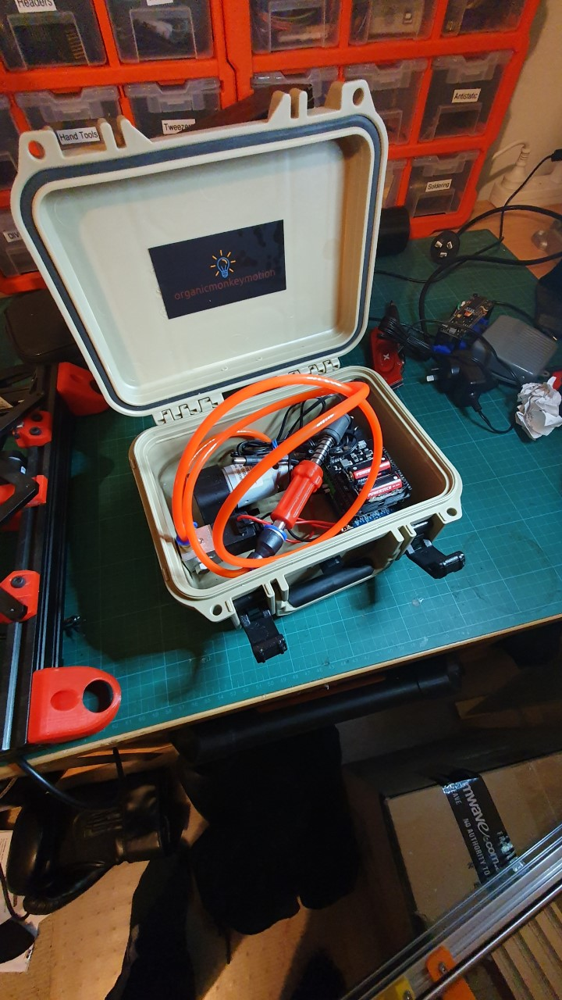
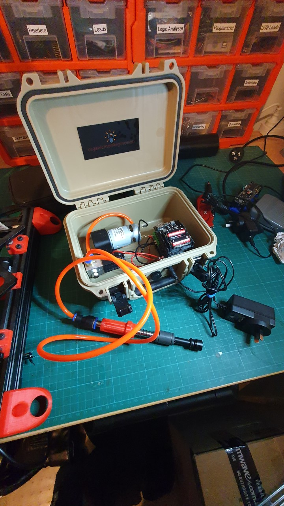

Very nice. I opted not to include the lead acid battery I bought to make this getup fully battery operated. I had an old 12V centre tapped power supply from an old discarded router. So, a simple fix was to add a power socket to the top of the case (near the vent). Since on/off is controlled by the Wemos board, I didn't bother with a switch. The power pack and the PnP pickup fit in the box.

Recalling, I have built a larger and a smaller manual PnP machine, so wanted one pump setup for both.

