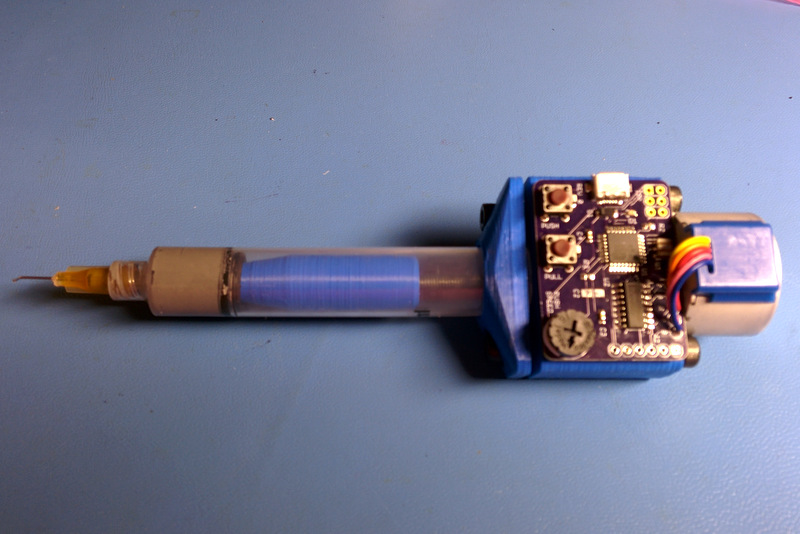
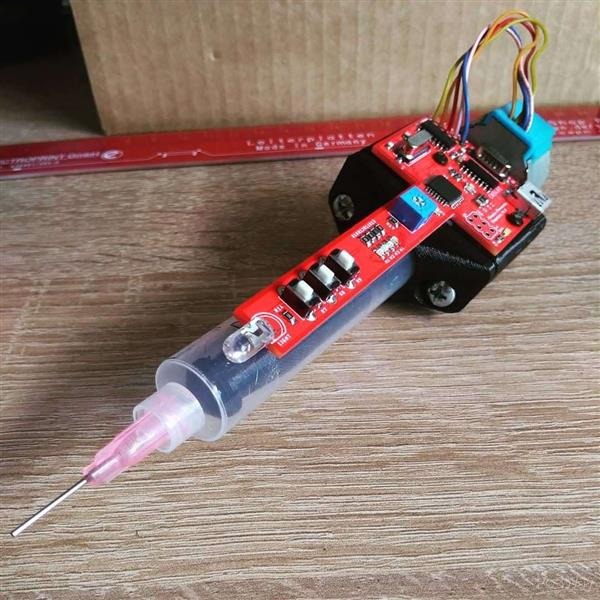
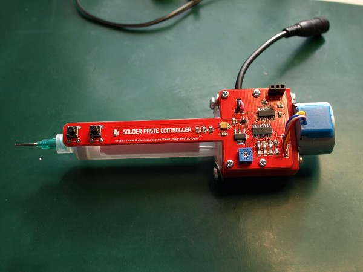
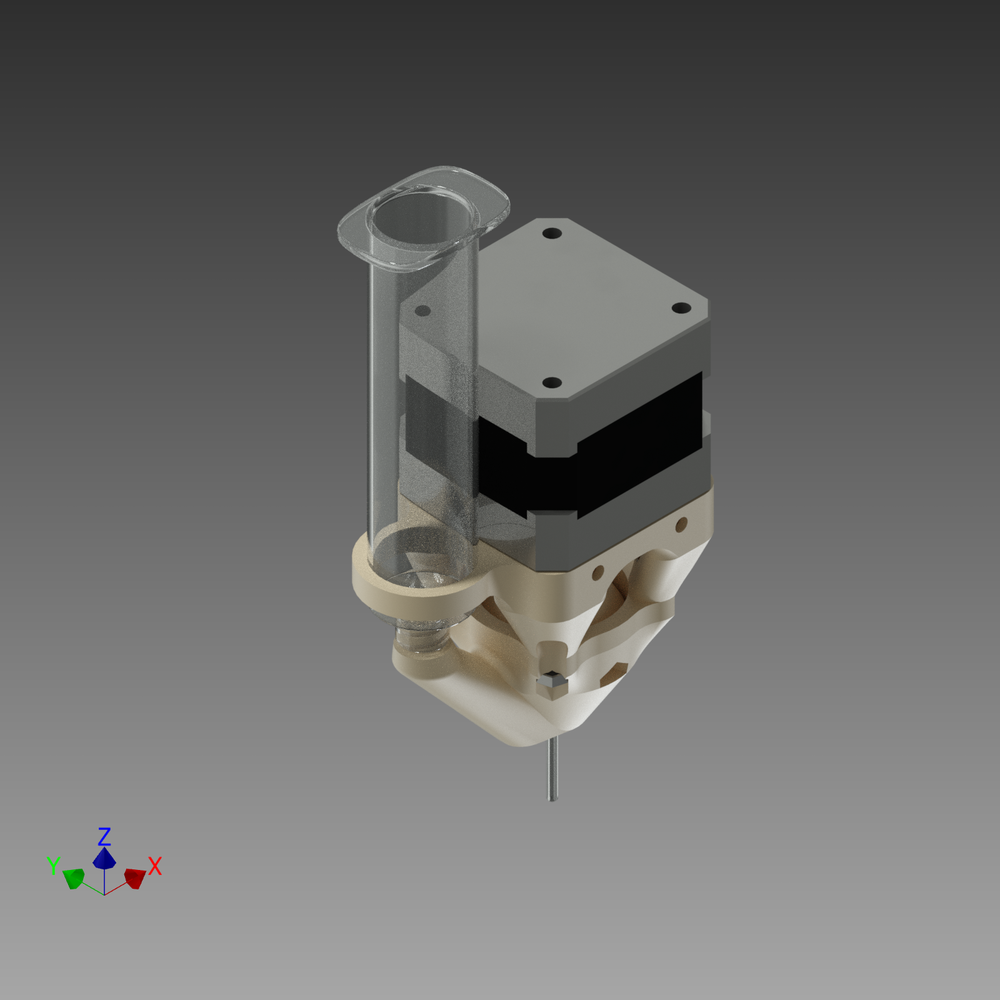
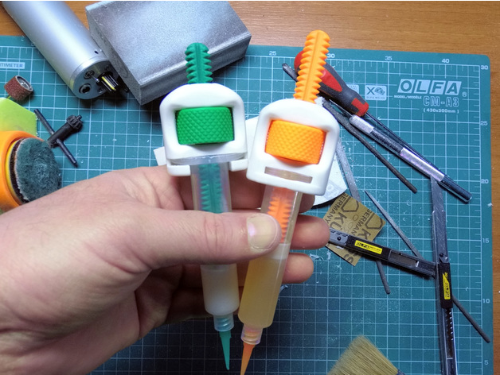
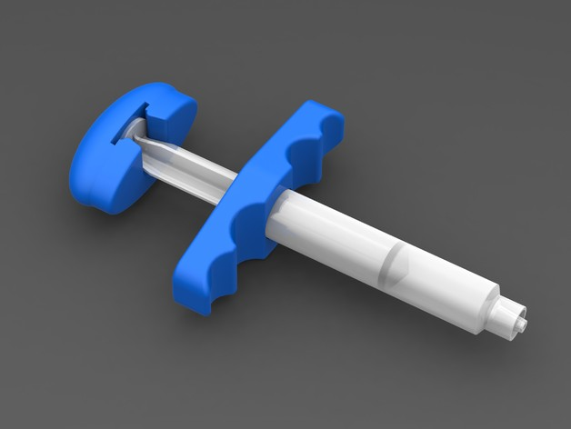

So, I did actually change my mind on the ATMEGA328P based paste dispenser [from](https://www.thingiverse.com/thing:1119914) really a PnP tool based:

To an interpretation of the hand held [same](https://www.pcbway.com/project/shareproject/Solder_paste_dispenser.html):

Which is still ATMEGA328P based, being an interpretation [of](http://dangerousprototypes.com/blog/2014/07/02/diy-solder-paste-dispenser/):

Which was PICAXE M14 microcontroller based.

Note again, the second option is for a hand paste dispenser. Do not write off the first option as it is perfect for use in your DIY PnP machine (does everything need be a NEMA17?). Or! [Maybe it does](https://0x7d.com/2014/3d-printed-precision-paste-dispenser/):

However, to actually progress through the process, I need a dispenser to build the inaugural ATMEGA328P dispenser.

Options are [either](https://www.thingiverse.com/thing:3148234):

[Or](https://www.thingiverse.com/thing:1242346):

So, the order of build will be:

1. Non-automated hand held paste dispenser.
2. Automated hand held paste dispenser.
3. Automated PnP paste dispenser.
4. [Non-CNC and therefore manual PnP machine](https://organicmonkeymotion.wordpress.com/2021/03/02/picky-picky-picky/) (to incorporate 3).
5. Assemble the 5 [ESP32 Wifi Robot boards](https://hackaday.io/project/163542-esp32-wifi-robot) I ordered from OSHPark, using my new manual PnP machine.

I have recently received the last delivery of parts for the ESP32 Wifi Robot boards. I am expecting the first delivery of frame bits for the PnP, with the hardware also ordered. I have yet to order the pneumatic bits.

So, pressure then to put my Flashforge Finder back together as I have to print the 3D parts for both the PnP and reprint the parts for the [Bear build](https://organicmonkeymotion.wordpress.com/prusa-i3-mk3-bear-build/), given I did not calibrate my Finder first and also a change in the design in the Bear designs, as well as I have [changed my mind about the extruder and the Brains](https://organicmonkeymotion.wordpress.com/prusa-i3-mk3-bear-build/design-musings/). So the [frame](https://organicmonkeymotion.wordpress.com/prusa-i3-mk3-bear-build/stage-1/) can finally get dusted off.

I otherwise have 5 each of the first and second ATMEGA328P based boards solder paste boards. Five is the minimum number of boards from PCBWay.

I have ordered parts to build all 5 of the hand (not PnP) version. I will try to sell 4 on ebay, in an attempt to pay off the the expenses. I am yet to buy parts for the PnP based version, but I'll do the same. Probably will also do the same with a couple of the ESP32 Wifi boards.

Won't be making me a [millionaire](https://www.youtube.com/watch?v=VrHLOGMT_kM) but might help soften the blow of the hobby.
