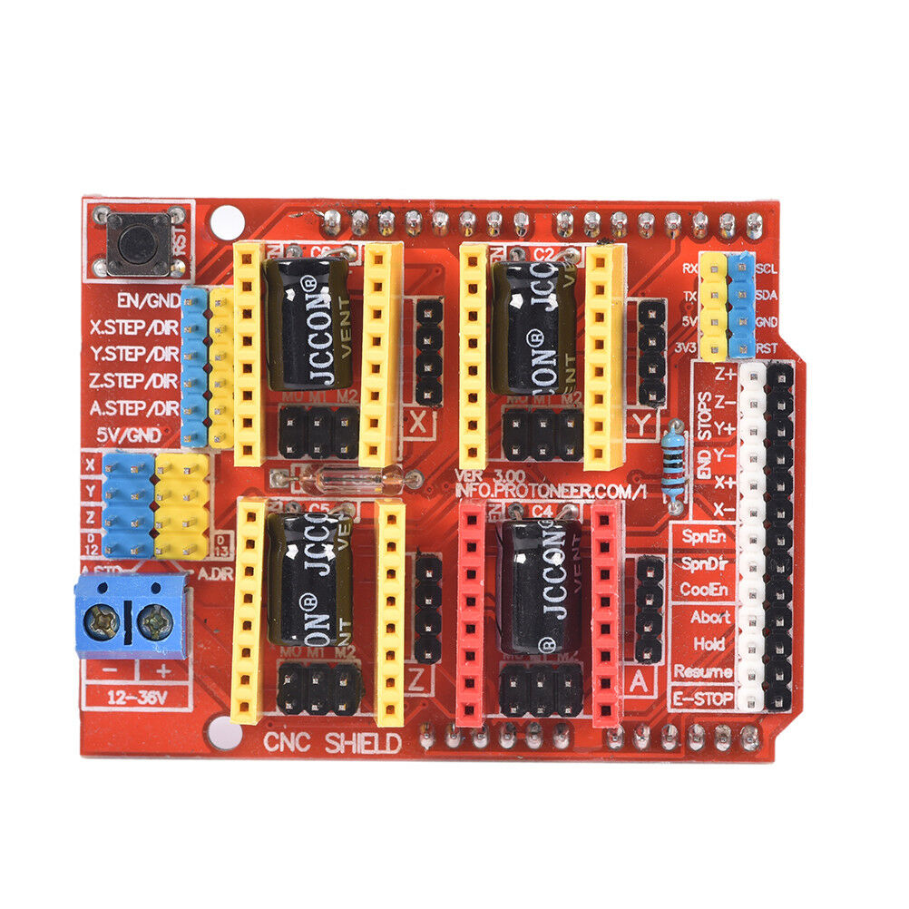

... certainly no cardboard tubes used in the production of this blog entry.

As mentioned elsewhere, I did centre on the board I would build into my [Bear clone](https://organicmonkeymotion.wordpress.com/prusa-i3-mk3-bear-build/design-musings/). BUT!

There's a but ...

BUT! I did want a low end hack board, to drive steppers and build little experimental rigs. So, I marvelled when I came across a project called [Grbl\_Esp32](https://github.com/bdring/Grbl_Esp32). Neat!

Now, there's options for buying boards, but it occurred that I might sneak Grbl\_Esp32 onto a ["Wemos D1 R32" clone](https://www.aliexpress.com/item/1005001621901111.html?spm=a2g0s.9042311.0.0.27424c4dxBxocN) (for real "Wemos", apparently now DIYMORE go [here](https://www.diymore.cc/products/esp32-wifi-bluetooth-4mb-uno-d1-r32-ch340-usb-b-devolopment-board-for-arduino)).

These nifty Wemos D1 R32 boards are an upgrade from the Wemos D1 R2, the board type that I built the first generation of [Opensprinklette](https://organicmonkeymotion.wordpress.com/category/opensprinklette/) upon. The Wemos D1 R2 being ESP8266 based, though still ample for managing the task at hand.

But, GRBL on a Wemos D1 R32 seems doable if you add a shield such as the CNC Shield V3.

So a MoBo for AUS$4.68 and shield for AUS$6.72 ... hmmm 8+2 is 10 ... carry the 1, etc. ... iterating ... AUS$11.40!!

Outside now of my occasional use of both [OpenSCAD](https://www.openscad.org/) and [FreeCAD](https://www.freecadweb.org/), I have also downloaded a few further CAM apps to begin famil, including:

* [GRBL Controller](https://github.com/zapmaker/GrblHoming/releases) (alterative [Universal GRGL Sender](https://winder.github.io/ugs_website/) or UGS)
* [CAMotics](https://camotics.org/)
* [OpenPnP](https://openpnp.org/)
* [DeepNest](https://deepnest.io/)
* [FlatCAM](http://flatcam.org/)

GRBL Controller was very happy talking the the Wemos D1 R32, which was running Grbl\_Esp32 in test mode. I just need wait on the CNC shield, to start working on configuring Grbl\_Esp32 to talk to the shield. Whether I need cut tracks etc. TBD. The pins of the DRV8825 I selected, to pop into the shield, read as 3.3V. Looks very, very doable.

Too much fun to be had!

Oh! Oh! Oh! Have a look at [SolveSpace](https://solvespace.com/index.pl).

