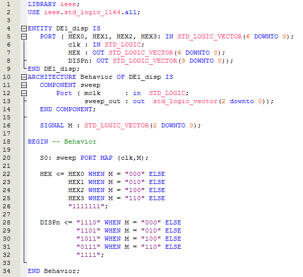

Well, not anymore.
You may or may not recall during the LAB I work that we knocked up a module to allow our Master 21EDA board to behave somewhat like a Altera DE1 board with respect to the way the displays worked.
While the original code worked it had a bug where a [ghost](https://organicmonkeymotion.wordpress.com/2014/07/08/grrrr/) of the preceding digit would show on the current digit display.
The problem was sorted thus:

Now it turns out if the signal M is 2bit then this doesn't work.  There is still a hangover were the enable moves to the next digit before the digit value changes.  The fix was then to set M to a 3bit counter and then set the unused cycles to all '1' - so all blank led segments when HEX="1111111", and setting all display enables to disabled when DISPn="1111".
NOTE
This is still clunky.  It may be fine for the display problem but it is likely not the best for signal problems (there may still be glitches in timing but the LED isn't bright enough now to notice).  Will need some investigation still and some playing with registering via coding patterns.  The likely way we want to fix it properly is to set the enables high, select the digit, then set the enable low each time.
