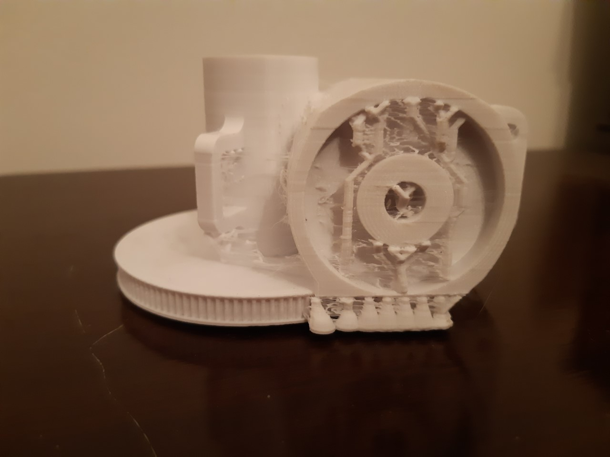

This is the elbow from a [Niryo](https://github.com/NiryoRobotics) robotic arm. I seem to be stuck though, since I got the flashforge finder, since it only prints up to 140mm cubic. Still, I can get most parts built and farm out the larger parts to my sister. I will need work on a larger 3d printer once I have mastered the art. I wish I had one of these years (even decades) ago when I did Industrial Design at University.
